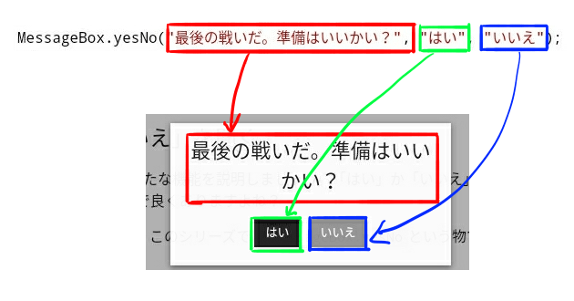

<link rel="stylesheet" href="https://cdnjs.cloudflare.com/ajax/libs/codemirror/5.35.0/codemirror.css" />
<script src="https://cdnjs.cloudflare.com/ajax/libs/codemirror/5.35.0/codemirror.js"></script>
<script src="https://cdnjs.cloudflare.com/ajax/libs/codemirror/5.35.0/mode/javascript/javascript.js"></script>
<style>
    .CodeMirror { height: auto; border: 1px solid #ddd; }
    .console { border: 1px solid #333; color: rgb(48, 68, 216); padding: 0px 5px 0px 5px; }

    .answer {color: red;  }
    .hideanswer { display: none; }
    .result {font-size: large;}
    .wrong {color: red;  }
    .correct {color: rgb(0, 89, 255);  }


    .column{
        padding: 0.5em 1em;
        margin: 2em 0;
        color: #5d627b;
        background: white;
        border-top: solid 5px #5d627b;
        box-shadow: 0 3px 5px rgba(0, 0, 0, 0.22);
    }    
</style>
<link rel="stylesheet" href="https://rawgit.com/karino2/js-introduction/master/scripts/smoke.css" />
<script src="https://rawgit.com/karino2/js-introduction/master/scripts/smoke.min.js"></script>                    
<!--
  何故かこちらではglobalObjectが無い。
  <script src="https://neil.fraser.name/software/JS-Interpreter/acorn_interpreter.js"></script>
-->

<script src="https://rawgit.com/karino2/js-introduction/master/scripts/acorn.js"></script>
<script src="https://rawgit.com/karino2/js-introduction/master/scripts/interpreter.js"></script>

<script type="text/javascript" src="https://rawgit.com/karino2/js-introduction/master/scripts/env.js"></script>


<script>
var questions = [];


  document.body.onload = function() {
    myInterpreter = new Interpreter('MessageBox = {show: SmokeAlert, yesNo: SmokeYesNo};', initFunc);
    scenarioPlayer = new Interpreter('MessageBox = {show: SmokeAlert, yesNo: SmokeYesNo};', initScnearioPlayerFunc);


    setupAllREPL2(8);
    setupAllQuestionsWithScnario(questions);
  }
</script>


さて、このシリーズもついに第四回まで来ました。
第四回からは中盤戦、という事で、アニメだったらオープニングが変わる感じですね。
ドラクエ2に例えると船とったくらい？(今の子には分からない例え)

第四回はif文なのですが、if文はこのシリーズの読者にはチョロい。  
何故なら、このシリーズは「ツクールとかである程度ゲーム作って、プログラム覚えたいと思った人」を対象としているからです。

ツクールでゲーム作る、というのは、ようするにマウスで延々とif文書いているようなものです。
普段からやってる事なので、割とすぐ理解出来ると思います。やったね！

ただこのシリーズは、油断しないでじっくりやっていきます。

# 「はい」か「いいえ」を聞く

if文の説明に入る前に、新たな機能を説明しましょう。「はい」か「いいえ」をプレーヤーに聞く方法です。
RPGのゲームとかで良くありますよね？

「はい」と「いいえ」は、このシリーズでは`MessageBox.yesNo`という物で質問する事にします。  
以下のようなコードです。

<div id="ex1">
<input type="button" value="実行" />
<textarea>
MessageBox.yesNo("最後の戦いだ。準備はいいかい？", "はい", "いいえ");</textarea>
<b>結果:</b> <span class="console"></span><br>
</div>
  
　  
何度か実行して、「はい」を押したり「いいえ」を押したりしてみてください。どう結果が違うか分かりますか？
テキストエリアの下の「結果」という所に注目してください。

唐突に出てきた`MessageBox.yesNo`ですが、`MessageBox.yesNo`の使い方は以下のようになります。

`MessageBox.yesNo(`**メッセージ**`,`**「はい」のラベル**`,`**「いいえ」のラベル**`);` 

この手の奴は、カンマ、つまり`,`で区切っていろいろ指定します。
yesNoボックスの場合だと、3つの文字を指定します。

一番最初のメッセージはまぁいいでしょう。  
2つ目と3つ目のラベル、というのは、「はい」と「いいえ」のボタンのメッセージになります。
ここに違う文字を指定する事で、ボタンの文字を変える事が出来ます。

指定した3つの文字と、実際の表示は、先程の例だと以下の図のような関係になっています。



「はい」と「いいえ」のボタンの所の文字を、実際に変えてみましょう。例えば以下のようになります。

<div id="ex2">
<input type="button" value="実行" />
<textarea>
MessageBox.yesNo("ついに念願のアイスソードを手に入れたぞ", "そう関係ないね", "殺してでも奪い取る");</textarea>
<b>結果:</b> <span class="console"></span><br>
</div>
  
　  
ちょっと横に長くて見づらいですね。こういう時には、別の行にしても大丈夫です。
たとえばこんな感じです。

<div id="ex3">
<input type="button" value="実行" />
<textarea>
MessageBox.yesNo("ついに念願のアイスソードを手に入れたぞ",
                 "そう関係ないね",
                 "殺してでも奪い取る");</textarea>
<b>結果:</b> <span class="console"></span><br>
</div>
  
　  
これでも同じ結果になります。「はい」のボタンが「そう関係ないね」になって、「いいえ」のボタンが「殺してでも奪い取る」になっていますよね。


なお、文字が長い時は変数を使っても構いません。


<div id="ex4">
<input type="button" value="実行" />
<textarea>
var msg = "ついに念願のアイスソードを手に入れたぞ";
var yesLabel = "そう関係ないね";
var noLabel = "殺してでも奪い取る";

MessageBox.yesNo(msg, yesLabel, noLabel);</textarea>
<b>結果:</b> <span class="console"></span><br>
</div>
  
　  
場合によっては変数を使う方が見やすい事もありますが、逆にわざわざ無駄に複雑にしてめんどくさいと感じる事もあります。
プログラムとしてはどれも同じ意味なので、その時の気分で、好きなやり方で良いです。

こんな風にプレーヤーに2つの選択肢を尋ねるのがyesNoボックスです。ツクールでもこういう事やりますよね。
少し自分でも書いてみましょう。

### 課題: 「あじゃはなんですか？」をプレーヤーに質問せよ


「あじゃはなんですか？」と聞いて、
「ニワトリです」「餅です」の2つの選択肢をプレーヤーに出してください。

（答え合わせ用スクリプトの都合で、必ず「はい」の方のラベルを「ニワトリです」にしてください。手抜きですまぬ…）

<script>
var q1obj = {
    id: "q1",
    scenarios: []
}
q1obj.scenarios.push({
    setup: ()=> returnValues.push(1),
    verify: () => {
        if(scenarioLogs.length != 1) {
          if(scenarioLogs.length == 0) {
            return "質問されませんでした。";
          }
          return "質問一回以外の事がされてます";
        }
        // {name:"yesNo", val:{msg, yeslabel, nolabel}}
        if(scenarioLogs[0].name != "yesNo") {
          return "質問されてません。";
        }
        var res = scenarioLogs[0].val;
        if(res.msg != "あじゃはなんですか？") {
          return "メッセージが「あじゃはなんですか？」じゃありません。";
        }
        if(res.yeslabel != "ニワトリです") {
          return "最初のボタンが「ニワトリです」じゃありません。";
        }
        if(res.nolabel != "餅です") {
          return "二番目のボタンが「餅です」じゃありません。";
        }
        return true;

    }
});
  questions.push(q1obj);
 </script>


<div id="q1">
    <input type="button" value="実行" />
    <textarea>
</textarea>
    <b>結果:</b> <span class="console"></span><br>
    <span class="result"></span><br>
    <input type="button" value="答えを見る" />
    <div class="answer hideanswer">
答え:<br>
MessageBox.yesNo("あじゃはなんですか？", "ニワトリです", "餅です");
    </div>        
</div>
  
　  
さて、出来ましたか？ちなみにニワトリなんですかね？餅なんですかね？一応私は餅だと思っているんですが…

**yesNoボックスの2つの流儀**  
`MessageBox.yesNo`は、このシリーズで勝手に決めた物です。`MessageBox.show`と同様で、
JavaScriptを実行する人、つまりツクールMVとかUnityとかそうした物が決める奴ですね。
第二回のコラムで説明しましたね。`環境`と言ったりもするのでした。  
　  
第四回で説明しているyesNoボックスは、Windowsプログラミングを参考にした形です。  
Mac OS、Linux(厳密にはX）などもこの形式ですね。
吉里吉里にもこの形のyesNoボックスがありますし、Unityも開発中にしか使えないデバッグ目的ですが、似たような機能があります。  
専門用語ではこれらのスタイルを、「モーダルダイアログ」といいます。難しいカタカナを使うと長渕に怒られるのでこのシリーズではコラム以外ではこの用語は使いません。日本語バンザイ。  
とにかく、Windowsのアプリを作ったりする時のスタイルです。  
　  
さて、yesNoボックスにはもうひとつ流儀があって、それは「コールバック」スタイル、と呼ばれています。
こちらは関数が必要となるので解説はこのシリーズの後半となりますが、残念な事にSecond LifeやツクールMVはコールバック型です。
コールバック型はちょっと難しいので、中盤のif文の説明として使う用途としては、Windows型の方がいいかな、
と思ったので、こちらを採用しています。  
このシリーズの最後の方ではコールバック型のyesNoボックスも扱います（たぶん）。  
　  
なお、webのJavaScriptはその中間みたいな立ち位置です。
基本的にはWindows型なのですが、これで出てくるボタンがださい。  
で、おしゃれなボタンを出すライブラリはコールバック型で作られています。
だから最近のおしゃれwebアプリはみんなコールバックで書く。
{: .column}

## 選択した結果を、変数で受け取る

さて、プレーヤーに「はい」と「いいえ」を聞く事は出来ましたが、
まだプログラムでは何も対応していません。
これでは聞くだけ聞いておいて投げっぱなしです。

対応するプログラムを書くのはこの第四回の主題となるif文という事になりますが、
その前にまずは結果を「受け取る」ということを見てみましょう。


### 結果を「返す」とは

ここまでの例で、「はい」を選ぶと結果の所に`1`が、「いいえ」を選ぶと結果の所に`0`が表示されていたと思います。
これは`MessageBox.yesNo`の決まりです(難しい言葉を使うと、仕様と言います）。

プレーヤーが「はい」を選ぶと、`MessageBox.yesNo(...)`は`1`という数値になるのです。
この、何かした結果、数字になる事を、「数字を返す」と言います。

`MessageBox.yesNo`に限らず、多くの機能は、結果を「返す」という決まりになっている事がほとんどです。

返す結果と指定する三つの文字、すべてをここにまとめておくと、`MessageBox.yesNo`は、

1. 文字を3つ受け取る
  - 一番目がメッセージ
  - 二番目が「はい」に相当するボタンのラベル
  - 三番目が「いいえ」に相当するボタンのラベル
2. プレーヤーが「はい」を選んだら`1`を、「いいえ」を選んだら`0`を返す

という物だと言えます。

このシリーズを全て終えたあかつきには、JavaScriptはまぁまぁ分かる、と言える状態になると思います。
その後は「環境」の勉強をする事になるでしょう。具体的にはツクールMVなどが、どういう機能を使わせてくれるか、という事です。

それは、上記のような提供されている機能の仕様を順番に調べていく、という作業になるので、たまにこうやって予行演習しておきます。

### 返された結果を、変数で受け取る

さて、話を戻して。

何かを実行した時の結果が返されたら、「変数」で受け取る事が出来ます。  
例を見てみましょう。プレーヤーの選択した結果なので、`sentaku`という変数で受け取る事にします。

コードとしては以下のようになります。

```
var sentaku = MessageBox.yesNo("最後の戦いだ。準備はいいかい？", "はい", "いいえ");
```

第三回でやった、文字に名前をつける、というコードと似ていますが、
`=`の右側が文字じゃなくて、`MessageBox.yesNo("最後の戦いだ。準備はいいかい？", "はい", "いいえ")`になっています。

このように、`=`の右側に結果を返す何かを置いておくと、左の変数に返された結果が入るのです。

試しに、変数に結果を受け取った後に、この変数を`MessageBox.show`で表示してみましょう。

<div id="ex5">
<input type="button" value="実行" />
<textarea>
var sentaku = MessageBox.yesNo("最後の戦いだ。準備はいいかい？", "はい", "いいえ");
MessageBox.show(sentaku);</textarea>
<b>結果:</b> <span class="console"></span><br>
</div>
  
　  
何度か実行して、「はい」を選んだり、「いいえ」を選んだりしてみてください。

なかなか複雑ですね。ちょっと自分でも書いてみましょう。

### 課題: プレイヤーが選択した結果に5を足して表示せよ

ちょっと難しい課題をやってみましょう。

1. まずyesNoボックスを表示します
  - メッセージには「あじゃは鶏ですか？」を表示します
  - ボタンは「はい」と「いいえ」です
2. 結果を`sentaku`という変数で受け取ります
3. sentakuに5を足した物を`MessageBox.show`で表示します
  - ヒント: 第三回の「課題: aに3を足した物をaに入れよ」を思い出そう

なかなか課題もプログラムっぽくなってきましたね。
これくらいになると一発で正解、とは、なかなかいかないかもしれませんね。  

ヒントとしては、2までは一つ前の例を参考にすると良いと思います。  
いきなり全部をマスター出来る物でも無いので、答えを見たり前の例を見直したりしながら、ちょっとずつ消化していきましょう。

<script>
var q2obj = {
    id: "q2",
    scenarios: []
}
q2obj.scenarios.push({
    setup: ()=> returnValues.push(1),
    verify: () => {
        if(scenarioLogs.length == 0) {
          return "質問されませんでした。";
        }
        if(scenarioLogs[0].name != "yesNo") {
          return "質問されてません。";
        }
        if(scenarioLogs.length == 1) {
          return "結果が表示されていません。MessageBox.showを使って表示してください。";
        }
        
        // {name:"yesNo", val:{msg, yeslabel, nolabel}}
        var res = scenarioLogs[0].val;
        if(res.msg != "あじゃは鶏ですか？") {
          return "メッセージが「あじゃは鶏ですか？」じゃありません。";
        }
        if(res.yeslabel != "はい") {
          return "最初のボタンが「はい」じゃありません。";
        }
        if(res.nolabel != "いいえ") {
          return "二番目のボタンが「いいえ」じゃありません。";
        }

        if(scenarioLogs[1].val != 1+5) {
          return "5が足されていません。";
        }
        return true;

    }
});
  questions.push(q2obj);
 </script>


<div id="q2">
    <input type="button" value="実行" />
    <textarea>
</textarea>
    <b>結果:</b> <span class="console"></span><br>
    <span class="result"></span><br>
    <input type="button" value="答えを見る" />
    <div class="answer hideanswer">
答え:<br>
var sentaku = MessageBox.yesNo("あじゃは鶏ですか？", "はい", "いいえ");<br>
sentaku = sentaku + 5;<br>
MessageBox.show(sentaku);<br>
    </div>        
</div>
  
　  

このように、`MessageBox.yesNo`という物を使って、プレーヤーに「はい」と「いいえ」をたずねる事が出来ます。

ここまでで「はい」と「いいえ」を聞く方法は分かりました。次はこれを使って結果に応じた対応をするプログラムを書きましょう。  
if文の登場です。

# ifで分岐しよう

ここまでで、「はい」か「いいえ」をプレーヤーに聞く方法が分かりました。
結果を変数に受け取る事も出来ました。

そこでこの変数の結果に応じて、対応を変えるコードを書いてみましょう。
ついに`if`文です。
まずは`if`文の例を見ていきましょう。

## はじめてのif (if文の3つの構成要素)

まずは例として、以下のコードを見ていきます。説明はおいといて、とりあえず実行してみましょう。

<div id="ex6">
<input type="button" value="実行" />
<textarea>
// sentakuという名前をつける
var sentaku = 1;

if(sentaku == 1) {
   MessageBox.show("sentakuは1です。");
}</textarea>
<b>結果:</b> <span class="console"></span><br>
</div>
  
　  
これが`if`です。
上のコードの2行目で、sentakuに0を入れるとどうなるかも試してみてください。0を入れたら何も表示されなくなったと思います。

では、このコードを細かく見ていきます。

まず一行目は第三回でやった内容です。覚えていますか？

```
// sentakuという名前をつける
var sentaku = 1;
```

sentakuという名前をつける、という意味でした。
より細かく言うと、sentakuという箱を作って1を入れる、という事です。

次が新しい。

```
if(sentaku == 1) {
   MessageBox.show("sentakuは1です。");
}
```

このコードで、**`sentaku`が`1`だったら`MessageBox.show("sentakuは1です。");`が実行される**という意味になります。  

もう少し細かく見ていきましょう。

if文には3つの構成要素があります。

1. `if`
2. `(`と`)`で囲まれている所
3. `{`と`}`で囲まれている所。


これらを順番に見ていきましょう。

といっても1番目の`if`はそのままで別段説明する事も無いので、二番目から見ていきます。

### 2番目、sentakuが`1`かどうかは、`==`でチェックする

2番目の`(`と`)`に囲まれている所は、上の例だと`(sentaku == 1)`になります。

さて、`==`という新しい物が出てきましたね（以前コラムでちょっと触れたけれど）。
こいつはなんでしょう？  
これは、変数が1なのか、などをチェックする為のものです。

JavaScriptでは、変数が1かどうかは、`変数==1`でチェックします。上の例だと`sentaku == 1`ですね。  
なお、0かどうかは`変数==0`でチェックします。

`==`とイコールを2つ並べるんですね。  
うわ、なんか知らない奴だ！難しそう！と思うかもしれませんが、ただそう決まっている、というだけです。

数学では（算数で挫折したって言ってんだろー、と聞こえて来そうですが…）普通`=`一つで同じような意味になりますが、
JavaScriptにおいては、普通の`=`は、「右の結果を左の箱に代入する」という意味で既に使われてしまっているので使えません。（以前少しコラムでも触れました）  
そこでJavaScriptでは`==`が、左と右が同じ、という意味にしよう、と昔、Netscape社の人が決めたのです。

さて、この2の、`(`と`)`の間で書いた事が正しい場合は、その次の3が実行される訳です。
なお、正しくない時は何も実行されません。

では次の3を見てみましょう。

### 3番目、`{`で囲まれている所

3番目の`{`と`}`に囲まれた所は、上の例だとコードが

```
if(sentaku == 1) {
    MessageBox.show("sentakuは1です。");
}
```

だから、関係無い所を消すと

```
                {
    MessageBox.show("sentakuは1です。");
}
```

ですね。

2番目に書いた`(sentaku==1)`が正しければ、この`{`で囲まれた所が実行されます。
逆に正しくなければ、実行されません。

### 以上を踏まえて全体を見直す

さて、3つの要素に着目して全体をもう一度見てみましょう。

```
if(sentaku == 1) {
   MessageBox.show("sentakuは1です。");
}
```

`(`で囲まれている所が正しければ、`{`で囲まれている所が実行される、これが`if`です。
図にすると以下みたいな感じでしょうか。


上のコードを言い換えると、

**`sentaku`が`1`だったら`MessageBox.show("sentakuは1です。");`を実行する**

という意味になります。

言葉にするとなんだか長ったらしいので、こういう時は自分でやってみる事です。ここらで課題をやってみる事にしましょう。

### 課題: sentakuが5だったら、「sentakuは5です。」と表示せよ。

以下の途中まで書かれているコードに、ifを追加してsentakuが5の時だけ表示されるようにし、
sentakuが6の時は何も表示されないようにしてください。

なお、この課題は自動で答えを検出するのが難しいのでいつも正解と出てしまいます（すみません）。
あってるかどうかは自分で

1. `var sentaku = 6;`の場合を実行して何も表示されない事
2. `var sentaku = 5;`の場合を実行してメッセージが表示される事

を試して確認してください。

<script>
var qobj = {
    id: "q3",
    scenarios: []
}
qobj.scenarios.push({
    setup: ()=> {},
    verify: () => {

        return true;
    }
});
  questions.push(qobj);
 </script>


<div id="q3">
    <input type="button" value="実行" />
    <textarea>
    // 5じゃないケース
    var sentaku = 6;

    // 5のケースは下の行をコメントじゃなくす
    // var sentaku = 5;

    // このままでは6の時も実行されてしまうので、5の時だけ実行されるように以下をifを使って変更
    MessageBox.show("sentakuは5です。");

</textarea>
    <b>結果:</b> <span class="console"></span><br>
    <span class="result"></span><br>
    <input type="button" value="答えを見る" />
    <div class="answer hideanswer">
答え:<br>
if(sentaku == 5){<br>
&nbsp;&nbsp;&nbsp;&nbsp;MessageBox.show(sentaku);<br>
}<br>
    </div>        
</div>
  
　  
この課題もちょっと難しいですね。
第四回は`if`自体はそんな難しく無くても、課題がこれまでやってきた事の組み合わせになって長くなってきたので、課題が難しい気がします。

さて、これで`if`の説明をしたので、次にこの`if`を使ってプレーヤーの選択に応じた対応をしてみましょう。


**なんか第四回の課題が難しい気がするんだけど…**  
第四回となる今回は、解説しているif自体はそんな難しくないと思うのですが、課題は全体的に難易度が高い気がします。
というのは、今回はプログラムを「書く」練習を兼ねているからです。  
　  
プログラムというのは、出てくる物を理解しているだけでは実は書けません。
これは、日本語が読めてもラノベが書けるとは限らないのと似ています。
書く為には、やはり「書く練習」が必要です。  
第四回は、意図的に課題を少し実践的な内容にしてあります。
だからif自体は分かっていても、課題を解くのはちょっと難しいはずです。
もしスラスラ解けるなら、プログラムの才能が他人よりあるのかもしれませんね。  
　  
書く練習は、最終的にはプラグインをいじったりゲームを作ったりする過程で自然とやれば良いものです。
そうやって勉強するのが一番の早道です。やはりやりたい事をやるのが一番やる気も出るし、上達も早い。  
ただ、最初はもう少し簡単な所で練習してからの方が、スムーズに始められると思います。
ゲームのチュートリアルみたいなもんですね。  
このシリーズでは、プラグインを書く事を想定して、このプログラムを「書く」練習もやっていきたいと思っています。  
　  
だから普通のプログラムの入門だとまだまだ読むだけであまり自分で考えて書く段階では無いこの辺でも、
このシリーズでは普通にプログラミングをやってみよう、という構成になっています。  
ひょっとしたら少し無謀で難しすぎるかもしれません。もしそうならごめんなさい。
{: .column}


## 「はい」と「いいえ」を聞いて対応してみよう

上の例では、`var sentaku = 1;`としていましたが、これでは面白く無いですね。  
これをプレイヤーに質問して、その結果を受け取るように変更しましょう。

それには

`var sentaku = MessageBox.yesNo(...);`という感じにするのでした。
やってみましょう。


<div id="ex7">
<input type="button" value="実行" />
<textarea>
// プレイヤーに「はい」か「いいえ」を聞いて
var sentaku = MessageBox.yesNo("最後の戦いだ。準備はいいかい？", "はい", "いいえ");

// 「はい」だった時は以下を実行
if(sentaku == 1) {
   MessageBox.show("「はい」が選ばれました。");
}</textarea>
<b>結果:</b> <span class="console"></span><br>
</div>
  
　  
何度か実行して、「はい」の場合と「いいえ」の場合を確認してください。  
このコードで、

**プレーヤーが「はい」を選んだら、`MessageBox.show("「はい」が選ばれました。");`を実行する**

という意味になります。

一つ一つはこれまでやってきた事ですが、短いコードの中にいろいろな事がありますね。  
良い機会なのでもう一度ここで復習する為に、順番にコードを見ていきましょう。

### プレーヤーの選択を受け取る（復習)

まずはプレーヤーに「はい」か「いいえ」を聞いて、その結果を変数`sentaku`で受け取っています。

```
var sentaku = MessageBox.yesNo("最後の戦いだ。準備はいいかい？", "はい", "いいえ");
```

`MessageBox.yesNo`というのは、三つ文字が指定出来て、左から順番に

1. メッセージ
2. 「はい」のボタンのラベル
3. 「いいえ」のボタンのラベル

でした。
そしてこの`MessageBox.yesNo`は、「はい」が選ばれたら`1`に「いいえ」が選ばれたら`0`になるのでした。

この結果を変数に受け取る、という事をする為に、`var`と`=`というのを使うのでしたね。

つまり全体としては、「はい」が選ばれたら`sentaku`に`1`が、「いいえ」が選ばれたら`0`が入るのでした。


### if文の3つの構成要素（復習)

次に、この`sentaku`を使った`if`があります。以下のようになっています。

```
if(sentaku == 1) {
   MessageBox.show("「はい」が選ばれました。");
}
```

三つの構成要素は

1. `if`
2. `(`で囲まれている所
3. `{`で囲まれている所

の三つでした。一つ目はそのままなので特に気にせず、2番目と3番目に着目します。

2番目の`(`で囲まれている所は、`(sentaku == 1)`となっていますね。
JavasScriptでは、左と右が同じ、という事は`==`とイコールを二つ書く決まりでした。

つまりこれで、**`sentaku`が`1`だったら** という意味になります。

そして`if`は、二番目の`(`で囲まれている所が正しかったら、三番目が実行される、という事でした。
三番目というのは`{`で囲まれている所、つまり以下のコードになります。

```
      {
   MessageBox.show("「はい」が選ばれました。);
}
```

言葉にすると長いですが、以上をまとめると、以下のコードは

```
if(sentaku == 1) {
   MessageBox.show("「はい」が選ばれました。");
}
```

**`sentaku`が`1`だったら`MessageBox.show("「はい」が選ばれました。");`を実行する**

という意味になります。

前半と合わせると、

**プレーヤーが「はい」を選んだら、`MessageBox.show("「はい」が選ばれました。");`を実行する**

という意味になります。

どうって事無いコードでも、全部説明すると長いですね。
長々とした説明を読むよりも、コードを読む方が楽かもしれません。

説明が良く分からなくても、結局は、以下のコードが何をやってるか分かればいいのです。

```
// プレイヤーに「はい」か「いいえ」を聞いて
var sentaku = MessageBox.yesNo("最後の戦いだ。準備はいいかい？", "はい", "いいえ");

// 「はい」だった時は以下を実行
if(sentaku == 1) {
   MessageBox.show("「はい」が選ばれました。");
}
```

ここまで長々と説明してきたのは、ようするにこのコードを理解する為の説明です。
なのでこのコードが分かるなら、説明なんて分からなくても問題ありません。

余談ですが、こういうコードは結構ツクールっぽいな、と思うのですが、どうでしょう？

# elseをつけよう

`if`には、必要ならその後に`else`をつける事が出来ます。
`else`というのは、「そうじゃなかったら」みたいな意味です。

例を見てみましょう。


<div id="ex8">
<input type="button" value="実行" />
<textarea>
// 今回は1じゃない数字を入れておく。なんでもいいけど3にする。
var sentaku = 3;

// 今回はsentakuは3なので、1じゃないのに注意
if(sentaku == 1) {
   MessageBox.show("sentakuは1です。");

   // ここからが新しい
} else {
   MessageBox.show("sentakuは1じゃないです。");
}</textarea>
<b>結果:</b> <span class="console"></span><br>
</div>
  
　  
さて、実行すると、**sentakuは1じゃないです。**と表示されたはずです。

`if`の所の`(`の中を見ると、`sentaku==1`となっています。

```
if(sentaku == 1) {
```

でも、今回は二行目で、`sentaku`に3を入れているので、これは間違っています。
間違っている時には、ifの後の`{`の所は実行されません。

ここまでは既に説明した内容です。

今回違うのは、その後の`else`の所です。

```
if(sentaku == 1) {
   ...
   // 中略
} else {
   MessageBox.show("sentakuは1じゃないです。");
}
```

`if`の所に書いてある事が間違っている時は、`else`の方が実行されるのです。


こうして、`if`が正しくない時だけ実行する、という事も出来るようになりました。


**実はelse ifというものもある**  
ここまで`if`と`else`を解説しましたが、JavaScriptには実はこの2つの他に、
`else if`という物があります。
そんなに難しい物でも無いので説明しても良かったのですが、あんまり使わないのでまぁいいか、と思って解説しない事にしました。
後の方で使う事になったらその時に解説しますが、
使わなかったら必要になるまで知らなくても構わないと思います。    
　  
`else if`は、理論的には使わなくても`if`と`else`だけで全く同じ事が出来ます。`else if`を使わないと実現出来ない事はありません。  
また、`if`と`else`だけしっかり理解していれば、`else if`は少しググってみれば何をやっているか、すぐ理解出来ると思います。  
　  
このシリーズは、いろんな事をざーっと説明するのでは無く、良く使う少数の物だけを詳しくじっくり解説していく、という方針で書いています。
基本的な事だけを理解していろいろ書いてみて、ある程度プログラミングという物に慣れた後に、細かい物はまとめて勉強する方がオススメだと思っているからです。（あなたもそう思うから他の入門では無くこのシリーズを見ているのでしょう？）
{: .column}

### 課題: こちんこちんと言えば？

さて、一通り説明が終わったので、全部使ったような例を二つほど、自分でも書いてみましょう。

まずは「こちんこちん？」と聞かれて、「はい」と答えたら「麦茶！」と表示し、「いいえ」と答えたら「こーしー」と表示するプログラムを作りましょう。
途中まで書いてあるので、`if`と`else`の所だけ書いてください。

<script>
var qobj = {
    id: "q4",
    scenarios: []
}
qobj.scenarios.push({
    setup: ()=> returnValues.push(1),
    verify: () => {
        if(scenarioLogs.length == 0) {
          return "質問されませんでした。";
        }
        if(scenarioLogs[0].name != "yesNo") {
          return "最初が質問じゃありませんでした。";
        }
        if(scenarioLogs.length == 1) {
          return "「はい」を選んだ時に、結果が表示されていません。MessageBox.showを使って表示してください。";
        }
        if(scenarioLogs.length >= 3) {
          return "「はい」を選んだ時、たぶん二回表示されています。";
        }
        if(scenarioLogs[1].name == "yesNo") {
          return "「はい」を選んだ時、二回質問されました。なんで？";
        }

        
        // {name:"yesNo", val:{msg, yeslabel, nolabel}}
        var res = scenarioLogs[0].val;
        if(res.msg != "こちんこちん？") {
          return "メッセージが違いそうです。";
        }
        if(res.yeslabel != "はい") {
          return "最初のボタンが「はい」じゃありません。";
        }
        if(res.nolabel != "いいえ") {
          return "二番目のボタンが「いいえ」じゃありません。";
        }

        if(scenarioLogs[1].val != "麦茶！") {
          return "こちんこちんなのに麦茶！になってない！";
        }
        return true;

    }
});
qobj.scenarios.push({
    setup: ()=> returnValues.push(0),
    verify: () => {
        if(scenarioLogs.length == 1) {
          return "「いいえ」を選んだ時に、結果が表示されていません。MessageBox.showを使って表示してください。";
        }
        if(scenarioLogs.length >= 3) {
          return "「いいえ」を選んだ時、たぶん二回表示されています。";
        }
        if(scenarioLogs[1].name == "yesNo") {
          return "「いいえ」を選んだ時、二回質問されました。なんで？";
        }

        
        if(scenarioLogs[1].val != "こーしー") {
          return "こちんこちんじゃないのにこーしーになってない！";
        }
        return true;

    }
});
  questions.push(qobj);
 </script>


<div id="q4">
    <input type="button" value="実行" />
    <textarea>
var tumetai = MessageBox.yesNo("こちんこちん？", "はい", "いいえ");

// 以下をtumetaiの値に応じてifとelseを書こう！
MessageBox.show("麦茶！");
MessageBox.show("こーしー");</textarea>
    <b>結果:</b> <span class="console"></span><br>
    <span class="result"></span><br>
    <input type="button" value="答えを見る" />
    <div class="answer hideanswer">
答え:<br>
if(tumetai == 1) {<br>
&nbsp;&nbsp;&nbsp;&nbsp;MessageBox.show("麦茶！");<br>
} else {<br>
&nbsp;&nbsp;&nbsp;&nbsp;MessageBox.show("こーしー");<br>
}<br>
    </div>        
</div>
  
　  
なかなか本格的なプログラミングになってきましたね。
これを一発で解くのはちょっと大変でしょう。

こういう物はとにかく慣れです。  
もう一問、似たような問題をやってみましょう。

### 課題: あじゃを鳴かせてみよう

次はあじゃを鳴かせてみましょう。
といってもあじゃはニワトリか餅か分かりません。

そこでプレーヤーに、「あじゃは何ですか？」と聞きましょう。
もし「ニワトリです」と答えたら「コケーーーッ」と鳴き、
もし「餅です」と答えたら「ムェーーーー！」と鳴く事にしましょう。

変数を用意しておくので、それを使って下さい。

<script>
var qobj = {
    id: "q5",
    scenarios: []
}

qobj.scenarios.push({
    setup: ()=>returnValues.push(1),
    verify: () => {
        if(scenarioLogs.length == 0) {
          return "質問されませんでした。";
        }
        if(scenarioLogs[0].name != "yesNo") {
          return "質問されてません。";
        }
        if(scenarioLogs.length == 1) {
          return "結果が表示されていません。MessageBox.showを使って表示してください。";
        }
        
        // {name:"yesNo", val:{msg, yeslabel, nolabel}}
        var res = scenarioLogs[0].val;
        if(res.msg != "あじゃは何ですか？") {
          return "メッセージが違います。";
        }
        if(res.yeslabel == "ニワトリです") {
          if(res.nolabel == "餅です") {
            if(scenarioLogs[1].val != "コケーーーッ") {
              return "ニワトリの時の鳴き声が違います";
            }
            return true;
          } else {
            return "二つ目のボタンが違います。";
          }
        }
        if(res.yeslabel == "餅です") {
          if(res.nolabel == "ニワトリです") {
            if(scenarioLogs[1].val != "ムェーーーー！") {
              return "餅の時の鳴き声が違います";
            }else {
              return true;
            }
          } else {
            return "二つ目のボタンが違います。";            
          }          
        }
        return "最初のボタンが違います。";
    }
});
qobj.scenarios.push({
    setup: ()=>returnValues.push(0),
    verify: () => {
        
        // {name:"yesNo", val:{msg, yeslabel, nolabel}}
        var res = scenarioLogs[0].val;
        if(res.yeslabel == "ニワトリです") {
          if(res.nolabel == "餅です") {            
            if(scenarioLogs[1].val != "ムェーーーー！") {
              return "餅の時の鳴き声が違います";
            }else {
              return true;
            }
          } else {
            return "二つ目のボタンが違います。";
          }
        }
        if(res.yeslabel == "餅です") {
          if(res.nolabel == "ニワトリです") {
            if(scenarioLogs[1].val != "コケーーーッ") {
              return "ニワトリの時の鳴き声が違います";
            }
            return true;
          } else {
            return "二つ目のボタンが違います。";            
          }          
        }
        return "最初のボタンが違います。";
    }
});
  questions.push(qobj);
 </script>


<div id="q5">
    <input type="button" value="実行" />
    <textarea>
var message = "あじゃは何ですか？";
var niwatoriLabel = "ニワトリです";
var mochiLabel = "餅です";
var niwatoriNakigoe = "コケーーーッ";
var mochiNakigoe = "ムェーーーー！";
</textarea>
    <b>結果:</b> <span class="console"></span><br>
    <span class="result"></span><br>
    <input type="button" value="答えを見る" />
    <div class="answer hideanswer">
答え:<br>
var sentaku = MessageBox.yesNo(message, niwatoriLabel, mochiLabel);<br>
<br>
if(sentaku == 1) {<br>
&nbsp;&nbsp;&nbsp;&nbsp;MessageBox.show(niwatoriNakigoe);<br>
} else {<br>
&nbsp;&nbsp;&nbsp;&nbsp;MessageBox.show(mochiNakigoe);<br>
}<br>
    </div>
</div>
  
　  
この課題までくると、もう普通のプログラミングですな。  
作る方（つまり私）も大変です(^^;

# 第四回まとめ

以上で`if`は終わりです。`if`自体のむずかしさよりも、その周辺が大変な回だったかもしれませんね。
以下に第四回でやった事をまとめてきます。

1. 「はい」、「いいえ」は`MessageBox.yesNo`でたずねる。
   - 文字を三つ指定する
      - 一つ目は表示されるメッセージ
      - 二つ目は「はい」に相当するボタンのラベル
      - 三つめは「いいえ」に相当するボタンのラベル
    - プレイヤーが「はい」を選ぶと`1`が**返ってくる**
       -「いいえ」を選ぶと`0`
2. プレイヤーの選んだ結果は、変数で受け取る
3. `if`は`(`と`)`で囲まれた所があってたら次の`{`と`}`を実行する
4. `else`がついてたら、`(`と`)`で囲まれた所が間違ってた時に実行される
5. `sentaku==1`という風に、`==`で変数が1かどうかを確認する

最後に`if`と`else`の図解も再掲しておきます。


