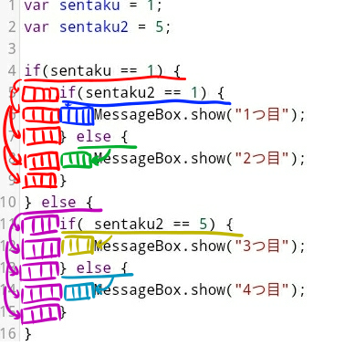

<link rel="stylesheet" href="https://cdnjs.cloudflare.com/ajax/libs/codemirror/5.35.0/codemirror.css" />
<script src="https://cdnjs.cloudflare.com/ajax/libs/codemirror/5.35.0/codemirror.js"></script>
<script src="https://cdnjs.cloudflare.com/ajax/libs/codemirror/5.35.0/mode/javascript/javascript.js"></script>
<style>
    .CodeMirror { height: auto; border: 1px solid #ddd; }
    .console { border: 1px solid #333; color: rgb(48, 68, 216); padding: 0px 5px 0px 5px; }

    .answer {color: red;  }
    .hideanswer { display: none; }
    .result {font-size: large;}
    .wrong {color: red;  }
    .correct {color: rgb(0, 89, 255);  }


    .column{
        padding: 0.5em 1em;
        margin: 2em 0;
        color: #5d627b;
        background: white;
        border-top: solid 5px #5d627b;
        box-shadow: 0 3px 5px rgba(0, 0, 0, 0.22);
    }    
</style>
<link rel="stylesheet" href="https://rawgit.com/karino2/js-introduction/master/scripts/smoke.css" />
<script src="https://rawgit.com/karino2/js-introduction/master/scripts/smoke.min.js"></script>                    
<!--
  何故かこちらではglobalObjectが無い。
  <script src="https://neil.fraser.name/software/JS-Interpreter/acorn_interpreter.js"></script>
-->

<script src="https://neil.fraser.name/software/JS-Interpreter/acorn.js"></script>
<script src="https://neil.fraser.name/software/JS-Interpreter/interpreter.js"></script>

<script type="text/javascript" src="https://rawgit.com/karino2/js-introduction/master/scripts/env.js"></script>


<script>
var questions = [];


  document.body.onload = function() {
    myInterpreter = new Interpreter('MessageBox = {show: SmokeAlert, yesNo: SmokeYesNo};', initFunc);
    scenarioPlayer = new Interpreter('MessageBox = {show: SmokeAlert, yesNo: SmokeYesNo};', initScnearioPlayerFunc);


    setupAllREPL2(5);
    setupAllQuestionsWithScnario(questions);
  }
</script>


第4.5回は総集編です。やはり中盤では総集編が無いとね。

というのは冗談ですが、今回は質問について答えてみようと思います。短めです。
頂いた質問は以下の3つです。

1. なんで次の行で空欄入れるの？
2. 改行のタイミングはどこ？
3. `{`と`}`って何？

なかなか難しい質問も混ざっているので全部ちゃんとは答えられないかもしれませんが、
理解の助けにしていただければと。


# 質問1: なんで次の行で空欄入れるの？

たぶん第四回では`if`が登場したので、なんか以下みたいなコードの時に、

```
if(sentaku == 1) {
    MessageBox.show("sentakuは1でした。");
}
```

二行目の所に、スペースが4つ入っている事を言っているのでしょうね。
空欄でもいいですが、プログラムだと普通は空白という気がする。まぁそんな事はどうでもいい。
どうでもいいついでに言うと、この空欄で段々を作る事を「インデント」といいます。でも長渕に怒られるのでカタカナは使いません。

で、この空欄については、確かに説明していませんでした。

まず、JavaScriptでは、行の先頭の空欄は、結果には一切関係ありません。なんと、無視されます！！
だから入れても入れなくても同じ意味です。

たとえば、以下の2つは全く同じ結果です。


<div id="ex1">
<input type="button" value="実行" />
<textarea>
var sentaku = 1;
var sentaku2 = 5;

if(sentaku == 1) {
    if(sentaku2 == 1) {
        MessageBox.show("1つ目");
    } else {
        MessageBox.show("2つ目");
    }
} else {
    if( sentaku2 == 5) {
        MessageBox.show("3つ目");
    } else {
        MessageBox.show("4つ目");
    }
}</textarea>
<b>結果:</b> <span class="console"></span><br>
</div>
  
　  
空白なしバージョン。
<div id="ex2">
<input type="button" value="実行" />
<textarea>
var sentaku = 1;
var sentaku2 = 5;

if(sentaku == 1) {
if(sentaku2 == 1) {
MessageBox.show("1つ目");
} else {
MessageBox.show("2つ目");
}
} else {
if( sentaku2 == 5) {
MessageBox.show("3つ目");
} else {
MessageBox.show("4つ目");
}
}</textarea>
<b>結果:</b> <span class="console"></span><br>
</div>


ではなんのために入れるか、というと、人間が見やすいように、です。
上の2つの例で、空欄がある方が見やすいのは納得してくれますよね。

空欄が無い方だと、たとえば`else`が3つありますが、2つ目の`else`は一体どの`if`に対応したものなのか、
良く分からないと思います。
空欄がある方なら、どの`if`に対応した`else`なのか、見れば分かると思います。

## 空白を入れるルール

空白をどういう時に入れるのか、というのは、ルールはありません。
cw警察がいつ来るか、みたいなのに似ていて、「これは駄目だろ〜」というのはあるのだけど、
細かい所は人によって意見は違って、ぶっちゃけどれでも構いません。

この手のはすぐ宗教論争になるので、どれかルールを一つえいっと決めて、心を無にしてそれに従うのがオススメです。
また、ルールと言っても別に見やすくないな、と思ったら気分で破ってOKです。

まず最優先としては、空白は最近のエディタなら勝手に入れるので、それに従うのが良いと思います。

以下では、そういうエディタの機能が無い場合などの為に、次善の策として簡単な目安を書いておきます。
ただ、割とどうでも良い事の割には言葉にするとなんだかややこしいので、分からなくてもあまり気にせず進んで、気になった時に見直すくらいでもいいかもしれません。

簡単には以下のようなルールとしておきます。

- `{`のつど、空白を4つ追加
- `}`のつど、空白を4つ引く
- 引数の途中では、引数の開きカッコに揃える（後述）

くらいでいいんじゃないでしょうか。

三番目はちょっと難しいので次にまわして、ここでは前2つを見てみましょう。
例えば先程の例の場合、こんな感じになっています。(空白を四角で描いてみました）。



こんな風に、カッコを開く時に次の行から4つ空白を足して、閉じる都度空白を4つ削る。
なんかあんま図にしてもわかり易くないですね…

まぁこんな感じです。

### 引数の所の空白ルール

引数ってなんだよ、という声が聞こえてきそうですね。
あんまりまだ説明したくないので、どうしたものか。

これまで出てきた例だと、yesNoボックスだけなので、具体例で話しましょう。  
例えば、第四回で以下みたいな例がありました。

<div id="ex3">
<input type="button" value="実行" />
<textarea>
MessageBox.yesNo("ついに念願のアイスソードを手に入れたぞ",
                 "そう関係ないね",
                 "殺してでも奪い取る");</textarea>
<b>結果:</b> <span class="console"></span><br>
</div>
  
　  
この「そう関係ないね」と「殺してでも奪い取る」の前の空白の個数は、
一行目の`(`の場所に揃える、というのが、「引数の途中では引数の開きカッコに揃える」という事の意味となります。

これは

- `"ついに念願のアイスソードを手に入れたぞ"`
- `"そう関係ないね"`
- `"殺してでも奪い取る"`

の3つが対等に並んでるのを分かりやすくする意図です。

一応言葉でまとめておくと、「`(`の後は、`(`の場所に揃える」となります。

まぁ所詮見た目の問題なので、良く分からなかったら気にしなくてもいいです。
自分が分かればいいんで。

# 質問2: 改行のタイミングはどこ？

これはこちらがちゃんと質問を理解しているのか自信が無いですが…  
たぶん上のyesNoの途中での改行とかが良く分からないな、と思ったのだと思っておきます。  
いい機会なので一応簡単に説明しておきますか。

ただ、JavaScriptは改行が結構変な振る舞いをする事があるので、
ちゃんと説明するのは結構難しい話になります。
なので、幾つか例をあげて、こんなもんです、くらいで勘弁してください。


## 改行はどこで入れられるか？は、実は難しい

JavaScriptでは、改行をどこに入れても平気なのか？という問題は、当然知りたい所だと思います。
でもこれ、実は相当に難しい問題で、ほとんどの人は良く分からないままなんとなく過ごすのです。

例えば

```
var a
= 3;
```

とかはOKなのですが、後で出てくる`return`というものを使った

```
return
3;
```

はNGになります。

なんで、という事を説明するのは結構難しいので、入れられない場合をちゃんと理解するのはとりあえず諦めましょう。
まぢかー、と思うかもしれませんが、結構そんなもんです。
どうしても知りたいならASIとかオートマティックセミコロンインサーションとかでググる事になりますが、まぁ気にしないのがオススメ。

このシリーズでは、明らかに改行を入れてもOKで、かつ良く入れる所だけを個別に覚えていきましょう。
それがゆとりの生き様って奴です。


## 改行を入れる原則


基本的には改行も上の空欄と似ていて、読みやすさの為に入れるものです。
なので、プログラミング言語としてどうか、というよりは、
人間側が読みやすいように適当にルールを作って、それにみんなが従う、という形になっています。

まず、改行を入れるのは以下の場所、というルールという事にしたいと思います。

1. 文の終わり（`;`の後）
2. `if {`と`else {`の後
3. 一行が長くなりすぎた時に適当に
   - yesNoボックスみたいに`,`で区切ってる場合は、`,`の直後
   - 変数などで`=`がある場合は、`=`の直後
4. 意味の区切りを分けたい時は間に空行を入れる


なお、読みやすい為のルールなので、別に破ってもいいです。
俺のロック魂はルールなんかじゃ縛れないぜ！と思ったら、こんなルールは無視して好きに改行を入れたり入れなかったりしていきましょう。

では個別に簡単に見ていきます。


### 1. 文の終わり(`;`の後）に改行。

これは特に問題無いでしょう。

例えば改行を入れない以下のコードでもいいのだけど、

```
var hoge = 1; var ika = 2;
```

やっぱり以下のように改行を入れる方が普通です。

```
var hoge = 1;
var ika = 2;
```

こうやって、一つの行でなるべく一つの事をするようにしておく方が読みやすい。


### 2. `if`と`else`の後

`if`と`else`の後は2つの派閥があり、

```
if(sentaku == 1) {
    MessageBox.show("sentakuは1");
}
```

と、

```
if(sentaku == 1)
{
    MessageBox.show("sentakuは1");
}
```

です。どっちでもいいですが、このシリーズでは`{`の後に改行を入れる事にしましょう。
つまり、以下の方ですね。

```
if(sentaku == 1) {
    MessageBox.show("sentakuは1");
} else {
    MessageBox.show("sentakuは1じゃない！");
}
```

### 3-1 yesNoボックスみたいなのが長くなりすぎた時は`,`の直後

ここからは、一行が長すぎるなー、と思った時に入れる例です。
つまり長すぎないな、と思ったら入れなくてOKです。
この辺は野生の勘で入れるか判断してください。

で、3-1はyesNoボックスなどでの場合を考えます。
たとえば以下の例。


```
MessageBox.yesNo("ついに念願のアイスソードを手に入れたぞ", "そう関係ないね", "殺してでも奪い取る");
```

これが長すぎるかは人による所ですが、もし長過ぎる、と思ったとしましょう。
こういう時は`,`で区切ってるので、この`,`の直後に適当に入れます。  
逆に言うと、**yesNoの間でも`,`のすぐ後は改行してOK**という事になります。  
こういう物の間でも改行出来るって最初はちょっと驚きますよね。

たとえば以下みたいにしてもOKという事です。

```
MessageBox.yesNo("ついに念願のアイスソードを手に入れたぞ",
                 "そう関係ないね", "殺してでも奪い取る");
```

別にもうひとつの`,`でも改行してもいいです。しなくてもいいです。
第四回では、私はどちらのカンマでも改行したい気分だったのでしました。


### 3-2 変数などで`=`がある場合は、`=`の直後

これは完全に宗教論争なので、どれが良い、という話では無く、このシリーズではこうします、という内容になります。
変数などで`=`がある時には、この直後に改行を入れてもOKです。
例えば以下みたいなコード

```
var tottemonagai_nagai_nagaiiiiiii_hennsuu = MessageBox.yesNo("あじゃは桜餅？","春だからね", "ニワトリでしょ！");
```

こんな文があった場合、`=`のすぐ後で改行してもいい、という事です。  
ようするに以下のコードでOK、という事。

```
var tottemonagai_nagai_nagaiiiiiii_hennsuu =
   MessageBox.yesNo("あじゃは桜餅？","春だからね", "ニワトリでしょ！");
```

`=`で改行した後にどれくらい行の頭に空欄入れるかは気分で適当に決めてください。

### 4. 意味の区切りを分けたい時は間に空行を入れる

この4はちょっとこれまでとは意味合いが違って、何もない行を挟むルールです。

これまでの例ではあまり無いですが、例えば変数をつくった後にifの手前にからっぽの行を入れたりして、
スペースを開けたりします。

たとえば以下みたいな感じ。

```
var a = "abc";
var b = "def;

if (a == 123) {
```

このように、`var b = "def";`と`if (a == 123) {`の間に、何も無い行が挟まってますね。
こうやって何も無い行を挟む事でスペースをあけて、上と下はちょっと違う感じですよ〜、という雰囲気を作ります。

だいたい

- var が続いた後にそれ以外の物が始まる時
- ifが始まる所の前

などに入れる事が多いですが、無くてもいいかな〜、と思う時には入れません。気分です。

全体的に改行をどこで入れるかは見た目の気分なので、深い意味はありません。
最初のうちは他人のコードを真似して同じ感じで入れておきましょう。


# 質問3: `{`と`}`って何？

なんか`{`とかって入れなくちゃいけないらしいが意味が分からない、という事ですかね。
まず最初に答えを言っておくと、`{`と`}`で、`if`とか`else`の有効範囲を示します。

ただ、ここまでの話を見ると、きっと空白でブロックを表現する言語に慣れているのでしょうね。
きっとツクールがそうなのでしょうか？（最後のコラム参照のこと）

という事で、その事も少し踏まえて説明していきます。

## `if`の終わりはどこまでか？

JavaScriptでは、行の最初の空欄には意味が無い、という話をしました。

そこで、その`if`の効果が持続する範囲、というのを示す必要があります。
具体例を考えましょう。

<div id="ex4">
<input type="button" value="実行" />
<textarea>
var sentaku = 1;

if(sentaku == 2) {
    MessageBox.show("ここはifの影響下");
    MessageBox.show("ここもifの影響下");
}
MessageBox.show("ここからはif関係ない");</textarea>
<b>結果:</b> <span class="console"></span><br>
</div>
  
　  
`if`の所に書いてあるのは`sentaku == 2`なので、この場合は中は実行されません（sentakuは1なので)。

さて、この実行されない範囲はどこまでか？というと、`}`が出てくる所まで、となります。
これが`}`の意味です。

別に`}`なんて無くたってそんなの分かるんじゃね？と思うかもしれませんが、
JavaScriptでは空欄が意味が無い、という話をしました。

だから、上のコードは以下のコードでも同じ意味になるのです。

<div id="ex5">
<input type="button" value="実行" />
<textarea>
var sentaku = 1;

if(sentaku == 2) {
MessageBox.show("ここはifの影響下");
MessageBox.show("ここもifの影響下");
}
MessageBox.show("ここからはif関係ない");</textarea>
<b>結果:</b> <span class="console"></span><br>
</div>
  
　  
この場合、どこがifの有効範囲か、というのは、`{`と`}`が無いと分からないと思います。

まとめると、**`{`と`}`は、`if`とか`else`がどこまで有効かを表す目印**という事になります。


**空白とブロック**  
行のはじめの空白は、JavaScriptでは意味がありません。
ですが、他の言語では意味がある場合があります。  
有名な所では、Pythonは行の先頭の空白で「ブロック」という物を表現します。  
　  
たとえば下にPythonでのif文の例を書いてみました。このコード例を見ると、`{`が無いけれど、ifの有効範囲を空欄の数で表現しているのが分かるかもしれません。（別にPythonを分かってる必要は無いので、意味分からん！と思ったら気にしないでもOKです）
　  
Pythonの他にも、Makefileとかyamlなどは行の頭の空白が意味がある例ですね。
大きく派閥としては
{: .column}
 
1. beginとendなどの対応するキーワードで有効範囲を示す言語（shスクリプト, rubyなど)
2. 空欄の数が同じ範囲を有効範囲とする言語（Python、Makefile、yamlなど）
3. `{`と`}`で有効範囲を示す言語(C言語、Java、JavaScript、C#など)

の3つくらいがあると思います。
JavaScriptは3番目という事ですね。  
　  
今回頂いた質問から推測すると、質問した人は派閥2の流儀の言語か何かに親しみがある人なのでしょうかね。
{: .column}


**pythonのコード例**
```python
sentaku = 1

if sentaku == 1:
    print("sentakuは1です。")
    print("ここも上のifの影響下です")
print("ここからはifは関係ありません")
print("行の頭に空欄が無いからですね")

```
