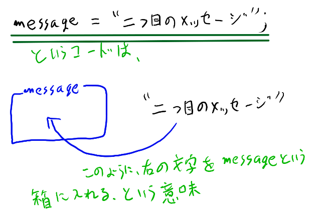

<link rel="stylesheet" href="https://cdnjs.cloudflare.com/ajax/libs/codemirror/5.35.0/codemirror.css" />
<script src="https://cdnjs.cloudflare.com/ajax/libs/codemirror/5.35.0/codemirror.js"></script>
<script src="https://cdnjs.cloudflare.com/ajax/libs/codemirror/5.35.0/mode/javascript/javascript.js"></script>
<style>
    .CodeMirror { height: auto; border: 1px solid #ddd; }
    .console { border: 1px solid #333; color: rgb(48, 68, 216); padding: 0px 5px 0px 5px; }

    .answer {color: red;  }
    .hideanswer { display: none; }
    .result {font-size: large;}
    .wrong {color: red;  }
    .correct {color: rgb(0, 89, 255);  }


    .column{
        padding: 0.5em 1em;
        margin: 2em 0;
        color: #5d627b;
        background: white;
        border-top: solid 5px #5d627b;
        box-shadow: 0 3px 5px rgba(0, 0, 0, 0.22);
    }    
</style>
<link rel="stylesheet" href="https://rawgit.com/karino2/js-introduction/master/scripts/smoke.css" />
<script src="https://rawgit.com/karino2/js-introduction/master/scripts/smoke.min.js"></script>                    
<script src="https://neil.fraser.name/software/JS-Interpreter/acorn_interpreter.js"></script>

<script type="text/javascript" src="https://rawgit.com/karino2/js-introduction/master/scripts/env.js"></script>


<script>
var questions = [];


  document.body.onload = function() {
    myInterpreter = new Interpreter('MessageBox = {show: SmokeAlert};', initFunc);


    setupAllREPL2(2);
    setupAllQuestions2(questions);
  }
</script>

# 変数は難しい？

さて、このシリーズも第三回までやってきました。
そしてついに出てきました。変数です。

変数、なんか数学っぽいですね〜。  
「小学校の算数で挫折したって言ってるだろっ！脳みそついてんのかー！」と怒られそうですが、やはり変数は避けては通れない。すみません。いや、私のせいじゃないですが。

そんな難しい物でも無いんですが、難しそうに見えるのにも理由はあります。

- 普段の生活であまり聞かない（ので馴染みが無い）
- 変数を使っても別段何も新しく出来るようにならないので、盛り上がらない（楽しくない）

さて、ここでは変数の話に入る前に、上に挙げた二つの変数の難しさについて、軽くポエムを書いてみたいと思います。

## 変数は、普段の生活であまり聞かない

変数という言葉は普段の生活では、あまり出てきません。  
たとえば、女子高生がマクドで「今日考えた変数、超イケてるじゃん？」とか言う話は、あまりしてない気がする。

わみたゃんとかが突然「私、変数大好き」とか言い始めたら相当ビビる。いや、ビビらないか？うーん、どうだろう。  
「レモン倶楽部で変数の話するからみんな来い！」とか言ってたら、なんか意識高い勉強会みたいになっちゃう。

とにかく、日常生活であまり出てこない考え方というのは、やっぱり慣れるまでにちょっと練習が必要です。
実際には大した事無くても。

世の中のプログラムの入門サイトとかは、数学とかで慣れている人向けの説明な事が多いので、
算数とか分からない系男子にはちょっと説明が早い、と感じる事はあるかもしれません。

ただ、さいわいな事に、変数は結構簡単です。ゆっくりやればどうって事無いと思います。
一見難しそう仲間として後に出てくる「関数」は、残念な事に実際にも結構難しいのですが、変数はぶっちゃけチョロい。

## 変数を使っても、新しい事は出来ない（からつまんない）

変数は、ループや関数まで行くといろいろ使いみちも出てくるのですが、この第三回の時点では何も新しく出来るようになりません。
例もこれまで見たのと大差無いし、コードを書いていても面白くない。

だから、世の中の入門ページでは、変数の所は軽くざざっと終わらせて次に進みがちです。  
でもそれが、必要以上に難しい感じをかもし出してしまっています。

そこでこのシリーズでは、あえて一回まるまるかけて、変数だけを扱う事にしました。
こうする方がわかりやすいとは思いますが、その分退屈な回になると思います。
退屈なのは頑張って気合で乗り切ってください！

# 変数ってなんなのさ

さて、ポエムはこの位にして、本題の変数についての話をしていきましょう。
変数は、先程もいった通りあまり日常生活では出てきません。

そこでこの第三回では、幾つかのバラバラに見える特徴を幾つか説明して、
それらを通して「変数ってこんな感じの物か〜」とふんわりと分かって欲しいと思います。

例えるなら、

- 朝にしか居ない事が多い
- よく、「いくよ！いくよ！」って言っている
- 白くて丸っこくてなんか頭に!!がついている
- 最近はブレンダー修行中
- お雑煮に入れて食べると美味しい

という説明をしていく事で、「ああ、あじゃってそういう物なのね」と分かってもらう感じです。

具体的には、変数を

- 名前をつけること
- 引っ越しの時に食器や服を入れる為のダンボール箱

という話を通して説明していきます。


## 変数とは、名前をつける事である

変数とは名前をつける機能です。実際に見てみましょう。

```
var message = "自意識チェックをしろ！";
```

このようなコードで、「自意識チェックをしろ！」という文字に、`message`という名前をつける事が出来ます。
messageというのは英語でメッセージの事。  
先頭にある`var`というのは変数を作る目印です。最初にこれをつけると、その次の単語がこれからつける名前となります。

で、イコール、つまり`=`を間に挟んで、右側に名前をつけたい対象を置きます。
イコールの意味が普通の算数とはちょっと違うので注意が必要です。

なんだが言葉にするとややこしいですね。こういう時はいつものように、いくつも似たような物を見るのです。

「そば充した。」という文字に、lucyという名前をつけるなら、こうなります。

```
var lucy = "そば充した。";
```

「おつ鍵」という文字にtakamiという名前をつけてみると、こうです。

```
var takami = "おつ鍵";
```

こんな風に、`var` __なんちゃら__ `=` __うんちゃら__ `;`と書くと名前が付けられます。

名前は、文字以外にもつける事が出来ます。
たとえば数字につけてみましょう。「答え」という事で`kotae`という名前をつけると、以下のようになります。


```
var kotae = 13-7;
```

こうすると`kotae`には、13-7で6が入ります。

このように、 `var`の後にスペースをあけて名前を書き、その後`=`を挟んで名前をつけたい物を置くと、名前をつける事が出来ます。

この名前が変数です。


### つけた名前を使おう

一度名前をつけると、以後プログラム上ではその名前を文字の代わりと出来ます。
例を見てみましょう。

まず名前をつけます。

```
var message = "自意識チェックをしろ！";
```

次に以下のようにすると、

```
MessageBox.show(message);
```

以下のように書いたのと同じ意味になります。

```
MessageBox.show("自意識チェックをしろ！");
```

実際にやってみましょう。


<div id="ex1">
<input type="button" value="実行" />
<textarea>
// この行で名前をつけて、
var message = "自意識チェックをしろ！";

// そのmessageという名前を以下で使う。
MessageBox.show(message);</textarea>
<b>結果:</b> <span class="console"></span><br>
</div>
  
　  
直接`MessageBox.show("自意識チェックをしろ！");`と書くのと、同じ結果になりました。

このように、名前をつける、というのが変数の一番重要な役割となります。
なんで名前なんてつけるのか、というのはループと関数あたりまで待ってください。

### 変数の名前の決まり

つけられる名前はローマ字で始まって数字とローマ字とアンダーバーが混ざった物くらいです。大文字でも小文字でもOKです。

例えば

`lucy`, `lucy123`, `shiroXmoko`, `Second_Life`などは全て変数名として使えます。

使えない物としては、`123lucy`などのように数字で始まるものや、`Second Life`などのように空白がある物などは駄目です。
`lucy123`はOKだけど`123lucy`が駄目なのは罠っぽいですね。

さて、名前は好きな物をつけて良いのですが、プラグインなどでは`a`とか`b`とか`n`とか`m`と`x`とか`y`とかの、短いものが多い気がします。
分かりにくいですね。  
また、messageは`msg`などと短くされがちです。

この辺は書いている人の趣味なので、なんでも良いのです。


## 変数は、物を入れる箱である

さて、ここまで、名前をつける、という事を見てきました。
この名前をつける、という部分だけで、変数の70%くらいの説明は終わりです。
70%、だいたい終わりですね。

ですが、まだ30%残ってます。この30%の説明として、次に「入れ物の箱」という見方を見ていきます。

### 変数は、引っ越しの時のダンボール箱みたいな物である

変数というのは、引っ越しの時のダンボール箱みたいな物です。
引っ越し、した事ありますか？

引っ越しの時は、中には食器を入れたり、服を入れたり、本を入れたりします。
で、箱にマジックで「服」とか「食器」とか「割れ物」とか「本」とか書きます。
変数と、このダンボール箱に物を詰めてマジックで名前を書く、というのは、凄く似ています。

さて、具体的にコードを見ていきましょう。

変数は、名前をつけるだけじゃなくて、同じ箱に別の物をあとから入れる事が出来るのです。
例えばこんなコードになります。

<div id="ex2">
<input type="button" value="実行" />
<textarea>
// messageという箱を作って、「一つ目のメッセージ」という文字を入れる
var message = "1つ目のメッセージ";

// 上で作った箱に、「2つ目のメッセージ」を入れる。
message = "2つ目のメッセージ";

// この時点ではmessageには「2つ目のメッセージ」が入っている。
MessageBox.show(message);</textarea>
<b>結果:</b> <span class="console"></span><br>
</div>
  
　  
実行してみると、「2つ目のメッセージ」しか表示されず、1つ目のメッセージはどこかに行ってしまいました。

何が起こっているのでしょうか？  
上のコードを、ちょっとずつ分割して見ていきましょう。

### イコールは、右の文字を左の箱に入れる、という意味

まず最初はこの二行でした。

```
// messageという箱を作って、「一つ目のメッセージ」という文字を入れる
var message = "1つ目のメッセージ";
```

`//`で始まる行はコメントでした。覚えていますか？コメントは何も意味が無い、という事で、この行は気にしないで良い。  

次の行は`var message = "1つ目のメッセージ";`となっていますね。
これは前半で説明した、名前をつける、という奴と同じコードです。「1つ目のメッセージ」という字に、`message`という名前がつきます。

違うのは次の行です。

```
// 上で作った箱に、「2つ目のメッセージ」を入れる。
message = "2つ目のメッセージ";
```

注目して欲しいのは、messageの前に`var`がついていません。これが今回の新しい所です。

これまでも何度か`var`というのが登場してきました。  
この`var`は、実はダンボール箱を作る、という意味なのです。

だから

```
var message = "1つ目のメッセージ";
```

だと、messageという箱が作られ、一方`var`が無い以下のコード

```
message = "2つ目のメッセージ";
```

だと、箱は作られず、既にある箱が使われます。

そしてイコール、つまり`=`は、右にある物を左に入れる、という意味になっています。
だから、以下のコード、

```
message = "2つ目のメッセージ";
```

というのは、`"2つ目のメッセージ"`を左の箱に入れる、という意味になります。



大切な事なのでもう一度言っておきます。

`イコールは、右にある物を左の箱に入れる、という意味`

これです。  
なお、箱にはいつも、一つしか物をいれる事は出来ません。
二つ目の物を入れると、1つ目の物は押し出されちゃう。小さい箱なんですね。

ここまでで変数の

- 名前をつける
- 物を入れる箱

という2つの側面を説明したので、変数についての説明は全て終わった事になります。
これで全部なのですが、最後に`var`について、箱という見方を踏まえてもう少し解説しておきます。


**JavaScriptの`=`は、普通のイコールと意味が違う**  
イコールというのは算数などでは普通、左と右が同じ、という意味なのですが、プログラム言語ではなぜか右の物を左に入れる、という意味になっています。  
算数なんて挫折したって言ってんだろ〜〜！という人にはあまり気にしなくて良い話題かもしれませんが、
プログラムを知らない人が、例えば  
　  
`a = a+1;`  
　  
みたいなコードを見ると、意味が分からない。イコールじゃないやん、と。でもこれは、右の奴を左の箱に代入する、という意味なので、「aに1を足したものを、aという箱に入れる」という意味になります。  
　  
なお、箱に入れる事を専門用語で「代入」といいます。意味も無く難しそうな言葉なのでこのシリーズでは使わないつもりですが、無意識に使ってしまってたらすみません。  
　  
JavaScript以外でも、イコールがこの「箱に入れる」という意味の言語は結構多くて、C言語とかJava言語とかC#とか、RubyとかPythonはだいたいイコールで箱に入れます。  
　  
ただ、別に全部の言語がそうという訳ではありません。Rでは`<-`で箱に入れますし、Delphiなどは`:=`です。  
`<-`は分かりやすいですね。  
こうしてみると、やっぱり`=`を全然違う意味で使うのは分かりにくい、と思っている人は結構居るんですね。  
ただこれらの言語は少数派なのが現状です。やっぱり「二文字タイプするのがめんどくさい」という事なんでしょうか。
箱に入れる、はプログラムでは凄くたくさん使う事なので。  
　  
余談になりますが、普通の算数の意味でのイコールは何故か`==`とイコールを2つ重ねた物を使う決まりになっています。なんでやねん。
{: .column}


### varは箱を作る、という意味

さて、最初に`var`という物をつけると、その行は名前をつける、という意味になる、といいました。
ですがイコールの意味を説明した今、もうちょっと詳しくこの事を説明出来ます。

`var`というのは、「箱を作る」という意味なのです。
ですから、以下の名前をつける、と言っていたコード、

```
var msg = "なんちゃら〜";
```

というのは、実は2つの事を一気にやっているのです。


1. `var msg`で箱を作る
2. 1で作った箱に`なんちゃら〜`という文字を入れる

この2つの事を一気にやるのが、
　  
```
var msg = "なんちゃら〜";
```

なのです。実はこれ、一気にやらずに一つずつやる事も出来ます。
コードにするとこんな感じです。

```
// 箱を作って
var msg;

// 箱に入れる
msg = "なんちゃら〜";
```

一つずつ見ていきましょう。  
まず、以下のようにすると`msg`という箱が出来る

```
var msg;
```

図にするとこんな感じ


そして、この箱に`なんちゃら〜`を入れる。箱に入れるのは`=`でした。

```
msg = "なんちゃら〜";
```

こんな感じ。図にするとこう。


こうして、`var`で箱を作って、`=`でその箱に入れる、という事を一気にやると、
「名前をつける」と言っていたコードになります。


**存在しない箱に入れると何が起こるのか？**  
`var`をつけずに、唐突に存在しない箱に入れる、つまり、突然`msg = "なんちゃら〜";`と、varをつけないでやると、何が起こるでしょうか？  
　  
普通のプログラム言語では、存在しない箱に入れようとすると、「そんな箱無い！」とエラーになります。  
ですがJavaScriptはここは凄い変な振る舞いをする変態言語さんなので、変な事が起こります。  
存在しない箱に入れようとすると、「グローバル」というなんだか難しい特別な所に箱を作って、そこに入れる、という意味だと解釈されるのです。  
　  
これはJavaScriptの有名な落とし穴で、`var`をつけ忘れた為に変なバグになってしまうと、間違え探しみたいな事を必死にやらないといけない事になります。  
JavaScriptに似た言語ではこのヘンテコな振る舞いは変更されている事もあります。
　  
「グローバル」な変数については、本シリーズではあまり扱わない予定ですが、最後の方でプラグインとか作る時に必要な程度、ちょこっと触れます。
{: .column}

# 第三回まとめ

さて、変数、いかがでしたでしょうか？難しかったですか？  
個人的には名前の難しそうな雰囲気に比べると、実は大した事無い情けない奴だと思っているのですが。

変数というのは、

1. 名前をつけるもの
2. 箱みたいなもの

である、という事でした。

そして、

1. `var`で箱を作る
2. `=`で箱に入れる

という物です。

これだけ分かっていれば入門レベルとしては十分すぎるくらい良く分かっていると思います。

### この第三回までで、このシリーズの序盤が終わりです

さて、この第三回の変数までやると、このシリーズの序盤が終わった事になります。
個人的にはここまでが、プログラムをやる上で一番難しい所、と思っています。

逆にここまで来れたなら、中盤は楽しくあっさり終えられるんじゃないでしょうか。

ここから先はif文や配列など、よりプログラムっぽい話題に移っていきますが、ラスボスの関数以外は難しい所はもう無いと思います。
まだ大したことはやってない、と思うかもしれませんが、実は凄く難しい事がいっぱい詰まっていたのです（本当です！）。

という事でもしここまでちゃんと進められたなら、おめでとうございます！あなたは、プログラムの一番大変な所は乗り越えられました！

