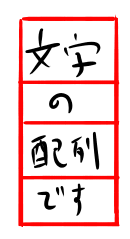
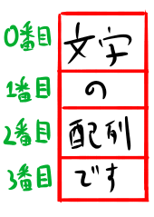

<link rel="stylesheet" href="https://cdnjs.cloudflare.com/ajax/libs/codemirror/5.35.0/codemirror.css" />
<script src="https://cdnjs.cloudflare.com/ajax/libs/codemirror/5.35.0/codemirror.js"></script>
<script src="https://cdnjs.cloudflare.com/ajax/libs/codemirror/5.35.0/mode/javascript/javascript.js"></script>
<style>
    .CodeMirror { height: auto; border: 1px solid #ddd; }
    .console { border: 1px solid #333; color: rgb(48, 68, 216); padding: 0px 5px 0px 5px; }

    .answer {color: red;  }
    .hideanswer { display: none; }
    .result {font-size: large;}
    .wrong {color: red;  }
    .correct {color: rgb(0, 89, 255);  }


    .column{
        padding: 0.5em 1em;
        margin: 2em 0;
        color: #5d627b;
        background: white;
        border-top: solid 5px #5d627b;
        box-shadow: 0 3px 5px rgba(0, 0, 0, 0.22);
    }    
</style>
<link rel="stylesheet" href="https://rawgit.com/karino2/js-introduction/master/scripts/smoke.css" />
<script src="https://rawgit.com/karino2/js-introduction/master/scripts/smoke.min.js"></script>                    
<script src="https://neil.fraser.name/software/JS-Interpreter/acorn_interpreter.js"></script>

<script type="text/javascript" src="https://rawgit.com/karino2/js-introduction/master/scripts/env.js"></script>


<script>
var questions = [];


document.body.onload = function() {
  myInterpreter = new Interpreter('MessageBox = {show: SmokeAlert, yesNo: SmokeYesNo}; Math = {randomInt: _randomInt};',initFunc);
  scenarioPlayer = new Interpreter('MessageBox = {show: SmokeAlert, yesNo: SmokeYesNo};  Math = {randomInt: _randomInt};', initScnearioPlayerFunc);


  setupAllREPL2(8);
  setupAllQuestionsWithScnario(questions);
}
</script>


第五回は配列です。

配列は、文字なんかを複数並べた物です。  
どうという事は無いのですが、RPGやアドベンチャーなどを作る時には良く使う事になるので、使いみちは多いものです。

また、この辺でプログラムに慣れていく事で、プログラマレベルを上げておきましょう。
という事で、ついでに乱数などもやって、ちょっと本格的なプログラムっぽい課題を最後にやってみたいと思います。
こういうのはレベル上げなんで、出来たり出来なかったりすると思いますが、バンバンやっていきましょう。

という事でまずは配列とはなんぞや？という所から。

# 配列って何よ？

配列は文字とか数字を並べた物です。

それってなんだよ、というのをちゃんと説明していくのは難しいので、まずは例をいろいろ見ていって、なんとなく分かっていく、というやり方をとりたい。

まずはるーしーな配列を作ってみます。こんな感じ。

<div id="ex1">
<input type="button" value="実行" />
<textarea>
// 配列を作る
var lucy = ["こちんこちん", "しゅるしゅる", "麦茶", "こーしー", "ネクター", "蕎麦充", "ぬっくぬく"];

// 配列の三番目を表示する。何故か結果は「こーしー」
MessageBox.show(lucy[3]);</textarea>
<b>結果:</b> <span class="console"></span><br>
</div>
  
　  
上のコードが配列の例です。`lucy`という変数に`配列`を入れて、その`3番目の要素`を取り出して表示しています。  
突然いろんな言葉が出てきましたね。順番に見ていきましょう。

なお、最初のうちは「なんでそんな事するの？」という気持ちでいっぱいだと思いますが、
そこは後から分かってくるので気にしないで進んでください。


## 配列の作り方

配列は、`[`と`]`でかこって、間を`,`で区切って作ります。
例を幾つか見てみましょう。

```
["文字", "の", "配列", "です"];
```

これで、`配列`という物が作れます。
文字が4つ並んでいる物です。

上のコードで、以下の図みたいな`配列`になります。



なお、この`配列`の中身一つひとつを`要素`といいます。

**`要素`ということば**  
`要素`、なんか難しい言葉ですねぇ。`要素`。「（キリッ」とか後ろにつけたくなる感じです。  
このシリーズでは、なるべく難しい言葉は使わないようにと考えているので、
最初この第五回は`要素`という言葉を使わずに書く気でした。  
　  
ただ、この`要素`という言葉、どうしても私が無意識に使ってしまうみたいで、使わないようにと思いながら書いていって、ふと文章を見直すと至る所で使っている…  
そういう訳で、諦めて今回でも`要素`という言葉を使っていく事にしました。すみません…
{: .column}


さて、配列は、数字でも作れます。例えば以下みたいな感じ。


```
[10, 11, 12, 13];
```

これで数字4つが入った配列が作れます。
今回はあまり使いませんが、ツクールとかのパラメータなんかは割と数値の配列になってる事が多そう（詳しくないので推測ですが）。

### 配列の改行とか空欄とか

4.5回で改行とか空欄をどう入れるか、みたいな話をしました。  
ついでなので、配列のその辺の話もちょっとしておきましょう。

配列の場合も`,`の直後に改行が入れられます。

```
["文字", "の",
 "配列",
 "です"];
```

また、`[`の直後に入れる事も出来ます。`]`の直前も入れられます。こんな感じ。

```
[
"文字", "の", "配列", "です"
];
```

配列で改行を入れた時に行の先頭にどれくらい空欄を入れるかは、あんまり決まってない気がします。  
気分で適当に入れたり入れなかったりしてください。


### 作った配列を変数に入れる

作った配列は、いつもと同じ感じで変数に入れる事が出来ます。
こんな感じ。

```
var hairetu = ["文字", "の", "配列", "です"];
```

こうすると、`hairetu`という変数に、作った`配列`が入ります。


## 配列の要素を取り出す

`配列`の`要素`は、配列の変数の名前の後に`[`と`]`をつけて、間に数字を指定すると取り出せます。

例えば以下のように配列を作って

```
var hairetu = ["文字", "の", "配列", "です"];
```

そして「の」という文字を取り出すとすると、こうなります。

```
hairetu[1];
```

実際に実行してみましょう。

<div id="ex2">
<input type="button" value="実行" />
<textarea>
var hairetu = ["文字", "の", "配列", "です"];
hairetu[1];</textarea>
<b>結果:</b> <span class="console"></span><br>
</div>
  
　  
注意して欲しいのは、1と指定しているのに二番目が取り出されている事です。
2と指定すると3番目が取り出されます。

<div id="ex3">
<input type="button" value="実行" />
<textarea>
var hairetu = ["文字", "の", "配列", "です"];
hairetu[2];</textarea>
<b>結果:</b> <span class="console"></span><br>
</div>
  
　  
これは配列が0から始まるからです。
ちょっと慣れが必要な所なので、もうちょっと説明してみます。

### 配列の始まりは0番目から

JavaScriptにおいては、配列の一番最初の要素は「0番目」と呼びます。

だから、先程の配列、

```
var hairetu = ["文字", "の", "配列", "です"];
```

は、以下の図のように並びます。



だから`[0]`だと「文字」が、`[1]`だと「の」が、`[2]`だと「配列」が取り出されます。

さて、以後このシリーズでも、配列の要素は0番目から数える事にします。
つまり、最初が0番目、二番目が1番目となります。ややこしいですね。

ですがこの2つが混在すると先に進んだ時に凄く混乱するので、
ここでJavaScriptに我々の方を合わせてしまう事にします。

言葉でうだうだ説明するとなんだか分かりにくいので、実際にやってみましょう。  
ここでは、第一回でやった「文字の連結」も使って、
0番目と2番目を一気に表示してみます。

<div id="ex4">
<input type="button" value="実行" />
<textarea>
var hairetu = ["文字", "の", "配列", "です"];
MessageBox.show("0番目は" + hairetu[0] + "、2番目は" + hairetu[2]);</textarea>
<b>結果:</b> <span class="console"></span><br>
</div>
  
　  
実行すると「0番目は文字、2番目は配列」と表示されたと思います。
区切りが無いといまいち分かりにくいですね。

さて、新しいわけでは無いですが、以下の所はちょっと難しいですね。

```
"0番目は" + hairetu[0] + "、2番目は" + hairetu[2]
```

これは`+`で文字を連結する、という奴ですね。一気に見るとなんか大変なので、最初2つだけ見てみましょう。


```
"0番目は" + hairetu[0]
```

この`+`というので、文字と文字を連結するのでした。  
第一回では以下みたいな例をやりました。覚えてますか？

```
"ぬっくぬくなこーしーを" + "しゅるしゅるする"
```

これの二番目が配列になっている訳ですね。
以下のコードで、

```
"0番目は" + hairetu[0]
```

`hairetu[0]`というのは、配列の0番目の要素を取り出す、という意味でした。
0番目の要素はこの場合`"文字"`となります。だから、上のコードは

```
"0番目は" + "文字"
```

と書いてあるのと同じ結果になります。
では以下のコードは？

```
"0番目は" + hairetu[0] + "、2番目は" + hairetu[2]
```

前半2つはここまで見てきた奴です。同じように後ろの`hairetu[2]`も実際の中身を入れてしまうと、

```
"0番目は" + "文字" + "、2番目は" + "配列"
```

と同じ意味、という事になります。これを実行すると、全て連結されて結果は`0番目は文字、2番目は配列`となります。

コード全体を突然見ると「うわー、なんじゃこりゃ〜〜！」って感じるかもしれませんが、
一つ一つ見ていけばどうって事無いと思うのですが、いかがでしょ？

なお、何番目を取り出すか、の所は、変数も使えます。例えば以下みたいなコードです。

<div id="ex8">
<input type="button" value="実行" />
<textarea>
// doreという変数に3を入れる
var dore = 3;

// 配列を作る
var hairetu = ["文字", "の", "配列", "です"];

// 上で作った配列のdore番目を取る。この場合は3番目、つまり「です」が入る
var message = hairetu[dore];

MessageBox.show(message);</textarea>
<b>結果:</b> <span class="console"></span><br>
</div>
  
　  
こういう風に、`hairetu[dore]`とやると、「dore番目」を取り出す事が出来ます。

この例だと「なんでわざわざdoreとかいう変数作るんだ？最初から3て書けばいいじゃん！」と思うかもしれませんが、
yesNoとか、あとの乱数とかを組み合わせるといろいろ技が使えるのです。

さて、うだうだと説明してきましたが、こういうのは実際にやってみる方が早い。
という事で課題を実際にやってっましょう。


### 課題: 「やれbot」の配列を作れ

とりあえず三つくらいにしておきますか。
以下の三つの文字を持つ配列を作ってください。

- 筋トレしろ
- 自意識チェックをしろ
- 聴け！


<script>
var qobj = {
    id: "q1",
    scenarios: []
}


qobj.scenarios.push({
    setup: ()=> {},
    verify: (intp) => {
        var actual = intp.pseudoToNative(intp.getProperty(intp.global, "yare"));
        if(actual == undefined) {
          return "変数 yareがどっかいっちゃった？";
        }
        var expect = ["筋トレしろ", "自意識チェックをしろ", "聴け！"];
        return verifyArrayEqual(expect, actual);
    }
});
  questions.push(qobj);
 </script>


<div id="q1">
    <input type="button" value="実行" />
    <textarea>
// この行を書き換えて、指定された配列を作れ。
var yare = [];

MessageBox.show(yare);</textarea>
    <b>結果:</b> <span class="console"></span><br>
    <span class="result"></span><br>
    <input type="button" value="答えを見る" />
    <div class="answer hideanswer">
答え:<br>
var yare = ["筋トレしろ", "自意識チェックをしろ", "聴け！"];
    </div>        
</div>
  
　  
もう一つ作ってみましょうか。

### 課題: lucyの配列を作れ

せっかくなのでlucyも作ってみましょう。
とりあえず以下くらいにしましょうか。

- こちんこちん
- ぬっくぬく
- 麦茶
- こーしー
- しゅるしゅるする

ちょっとコピペがかったるいかもしれませんが、頑張れ。

<script>
var qobj = {
    id: "q2",
    scenarios: []
}


qobj.scenarios.push({
    setup: ()=> {},
    verify: (intp) => {
        var actual = intp.pseudoToNative(intp.getProperty(intp.global, "lucy"));
        if(actual == undefined) {
          return "変数 lucyがどっかいっちゃった？";
        }
        var expect = ["こちんこちん", "ぬっくぬく", "麦茶", "こーしー", "しゅるしゅるする"];
        return verifyArrayEqual(expect, actual);
    }
});
  questions.push(qobj);
 </script>


<div id="q2">
    <input type="button" value="実行" />
    <textarea>
// この行を書き換えて、指定された配列を作れ。
var lucy = 0;

MessageBox.show(lucy);</textarea>
    <b>結果:</b> <span class="console"></span><br>
    <span class="result"></span><br>
    <input type="button" value="答えを見る" />
    <div class="answer hideanswer">
答え:<br>
var lucy = ["こちんこちん", "ぬっくぬく", "麦茶", "こーしー", "しゅるしゅるする"];
    </div>        
</div>
  
　  
配列の作り方はこんな感じです。数をこなしていけばすぐ慣れると思うので、バンバン書いていきましょう。  
作り方はこんな所にして、次は`要素`の取り出し方をやってみましょう。

### 課題: 配列の要素を取り出して文を作れ

以下の配列、lucyから要素を取り出して、それと残った文を組み合わせて

「さて、お濁り様の小宴は開くとしようかね。」

という文を表示せよ。

この課題は、ちょっとパズルっぽいです。二行目には`,`が複数あるのに注意。「ぜろ、いち、にー、さん、よん…」と何度も数える事になるでしょう。

<script>
var qobj = {
    id: "q3",
    scenarios: []
}


qobj.scenarios.push({
    setup: ()=> {},
    verify: (intp) => {
        if(scenarioLogs.length == 0 || scenarioLogs[0].name != 'alert') {
          return "結果が表示されていません。MessageBox.show使ってね。";
        }
        var actual = scenarioLogs[0].val;
        if(actual != "さて、お濁り様の小宴は開くとしようかね。") {
          return "表示されたメッセージが違います。";
        }
        return true;
    }
});
  questions.push(qobj);
 </script>


<div id="q3">
    <input type="button" value="実行" />
    <textarea>
var lucy = ["開くとしようかね",
            "こーしー", "お濁り様の", "もぅ、しみっしみ、もぅ",
            "麦茶", "小宴は"];


// 以下の行を書き換えて、目的の文を完成させてください。ただしlucy配列と+を（たくさん）足すだけで出来るはず。
var onigori = "さて、" + lucy[1] + "。";

MessageBox.show(onigori);</textarea>
    <b>結果:</b> <span class="console"></span><br>
    <span class="result"></span><br>
    <input type="button" value="答えを見る" />
    <div class="answer hideanswer">
答え:<br>
var onigori = "さて、" + lucy[2] + lucy[5] + lucy[0] + "。";
    </div>        
</div>
  
　  
こんな感じです。現時点では、とりあえず書き方に慣れてください。使い方はおいおい分かって来ると思うので。

**配列の最初は0番目？1番目？**  
配列の最初が0番目か1番目かは、言語によって異なります。
だいたいかっこつけてる言語は0番目から数えて、ゆとりっぽい言語は1番目から数えます。  
　  
例えばJavaScript、C、Javaなどはみんな0番目ですね。  
　  
一方で1番目から始まる言語は、有名な所ではVBが1番目からですね。プログラムじゃないけどExcelも1から始まりますね。  
そういえばRとかMatlab、Octaveなどの数値計算系の言語も1番目か。  
こうして並べてみると、むしろ1番目から始まる言語の方が難しそうなのが多いですね。  
ゆとり説は最近は嘘か。  
　  
なんにせよ、配列の最初の要素が0か1かは言語によって決まっていて、
JavaScriptはたまたま0番目から数える言語だ、という事です。
{: .column}


# 乱数でランダム

配列だけだといまいち面白い例が作れないので、ついでに乱数もやっておきましょう。
乱数は普通の人には難しい概念ですが、ツクールとか触っている人は結構余裕でしょう。

さて、乱数も厳密には環境ごとに定義される物ですが、乱数に関しては、だいたいどこの環境も似たりよったりです。
このシリーズでは、`Math.randomInt`という物をこの目的に使う事にします（これはツクールMVと同じです）。

例えば、0, 1, 2, 3, 4のどれかの数字を得たい場合、以下のようにします。

```
Math.randomInt(5);
```

この`randomInt`は、0から指定された数字の「一つ下」までの乱数を返します。
上の例では`5`を指定しているので、0から4までの乱数を返します。つまり「0, 1, 2, 3, 4」のどれかですね。

数字は一つしか指定しません。いつも開始は0からで、指定した数字の一つ下までの数のどれかがランダムで得られます。

`5`を指定すると`5`は返ってきません。
`4`までしか返って来ないのです。  
なんでよ！？って思うかもしれないけれど、そういうものなのです。ツクール MVだってそうなんです。  
0から数えるので一つ下まで、という事なのかもしれませんが、良く知りません。そう決まってるんです。

実際に動かしてみましょう。


<div id="ex5">
<input type="button" value="実行" />
<textarea>
var doreka = Math.randomInt(5);
MessageBox.show(doreka);</textarea>
<b>結果:</b> <span class="console"></span><br>
</div>
  
　  
何度か実行すると、0〜4の数字のどれかが毎回変わって実行されるはずです。
そして何回実行しても5にはならないはずです。

一行目の`Math.randomInt(5)`の5の所に違う数字をいれていけば、違う範囲の乱数が得られます。
10を入れれば0から9までのどれか。100を入れれば0から99までのどれかの数が得られます。


### 3から6までの乱数を作る

範囲を広げたり縮めたりするのは、`randomInt`に指定する数字を変えれば出来そうです。

でも、毎回0からじゃ困る事がありますよね。
例えばサイコロ作るなら1から6です。0の目とか出られても困ります。

そういう時は、結果に1を足せば良いのです。
サイコロはわかりやすいので課題にまわして、例えば3〜6の乱数が欲しいとします。

そういう時は、0〜3の乱数を作って、3を足せば良いのです。
やってみましょう。

**3, 4, 5, 6の４つの数のどれかを表示**
<div id="ex6">
<input type="button" value="実行" />
<textarea>
// 0, 1, 2, 3のどれか
var doreka = Math.randomInt(4);

// 3を足すので、3, 4, 5, 6のどれかになる。
doreka = doreka + 3;

MessageBox.show(doreka);</textarea>
<b>結果:</b> <span class="console"></span><br>
</div>
  
　  
どうですかね。足し算！算数！無理！とかだったらごめんなさい…  
でも0以外から始めたい事、たまにありますよね〜。

なお、乱数をとる所で、その場で足す事も出来ます。
以下みたいなコードですね。最後の「+3」に注目。

```
var doreka = Math.randomInt(4) + 3;
```

こんな風に一行で「3, 4, 5, 6」のどれかの数を得る事が出来ます。結果は上のコードと一緒です。

まぁ一気に書いても二行に分けても、どっちでもいいです。分かりやすい方で行きましょう。
では課題です。


### 課題: 6面サイコロを作れ

1から6までの数字をランダムに表示してください。


**1～6をランダムに表示せよ**

<script>
var qobj = {
    id: "q4",
    scenarios: [],
    sampleNum: 1000
}

function verifyDice(intp, expects) {
  if(scenarioLogs.length == 0 || scenarioLogs[0].name != 'alert') {
    return "結果が表示されていません。MessageBox.show使ってね。";
  }

  var counts = countElem(scenarioLogs.map((res)=> res.val));
  var resKeys = Object.keys(counts);
  if(resKeys.length != expects.length) {
    if(resKeys.length < expects.length) {
      return "サイコロの目が" + resKeys.length +"個しかありません。足りない！";
    }else {
        return "サイコロの目が" + resKeys.length +"個もあります。多すぎ！";
    }
  }
  var checkKey = _verifyArrayEqualInternal(expects, resKeys);
  if(checkKey != true) {
    return checkKey + "の目がずっと出ません";
  }
  var enough = true;
  for(var i = 0; i < resKeys.length; i++) {
    if(counts[resKeys[i]] < 100) {
      return resKeys[i] + "の目が十分出てないです。";
    }
  }
  return true;  
}


qobj.scenarios.push({
    setup: ()=> {},
    verify: (intp) => verifyDice(intp, ["1", "2", "3", "4", "5", "6"])
});
  questions.push(qobj);
 </script>


<div id="q4">
    <input type="button" value="実行" />
    <textarea>
// 以下の行を書き換えて、saikoroに1から6のどれかがランダムで入るようにしてください。
var saikoro = 1;

MessageBox.show(saikoro);</textarea>
    <b>結果:</b> <span class="console"></span><br>
    <span class="result"></span><br>
    <input type="button" value="答えを見る" />
    <div class="answer hideanswer">
答え:<br>
var saikoro = Math.randomInt(6);<br>
saikoro = saikoro+1;
    </div>        
</div>
  
　  
せっかくなのでもう一つ、似たような課題をやりましょう。

### 課題: 12面サイコロを作れ

せっかくなので12面サイコロも作っておきましょう。
1から12までの数字をランダムに表示してください。


**1～12をランダムに表示せよ**

<script>
var qobj = {
    id: "q5",
    scenarios: [],
    sampleNum: 5000
}


qobj.scenarios.push({
    setup: ()=> {},
    verify: (intp) => verifyDice(intp, ["1", "2", "3", "4", "5", "6", "7", "8", "9", "10", "11", "12"])
});
  questions.push(qobj);
 </script>


<div id="q5">
    <input type="button" value="実行" />
    <textarea>
// 以下の行を書き換えて、saikoroに1から12のどれかがランダムで入るようにしてください。
var saikoro = 1;

MessageBox.show(saikoro);</textarea>
    <b>結果:</b> <span class="console"></span><br>
    <span class="result"></span><br>
    <input type="button" value="答えを見る" />
    <div class="answer hideanswer">
答え:<br>
var saikoro = Math.randomInt(12);<br>
saikoro = saikoro+1;
    </div>        
</div>
  
　  
サイコロが作れれば乱数はだいたい十分でしょう。

第5回としてはここまでで終わりでいいんですが、この位いろいろ揃うと、結構実際的なプログラムが作れます。  
いい機会なので、最後にチャレンジ課題として、配列と乱数を組み合わせて、botのような振る舞いをするプログラムを書いてみましょう。
短いですが、結構本格的なプログラミングになります。

# 配列と乱数を使って、botもどきを作ろう

配列と乱数を使うと、簡単なbotが作れます。
といっても実際にマストドンなどに投稿するのは面倒なので、ここではボットもどき、として、ランダムにメッセージが表示される、というプログラムを作ってみましょう。

まずはlucyボットです。

## lucyボット（もどき）を作ろう

実行、を押す都度、lucyニキのセリフを表示する、lucyボットを作ってみましょう。
原理としては、配列に使うメッセージを一通り入れておいて、乱数で何番目を表示するか、を決めて、そこを表示します。

まずコードを示します。以下のコードを何度か実行してみてから、続く解説を読んで下さい。

<div id="ex7">
<input type="button" value="実行" />
<textarea>
// 1. 配列を作る
var lucy = [
  "蕎麦充した（⌒_⌒）",
  "るーひー♪",
  "さて、始業しようかねぇ。",
  "さて、お濁り様の小宴は開くとしようかね。",
  "こちんこちんに冷えた麦茶を飲み干した。",
  "ぬっくぬくなこーしーをしゅるしゅるしている。"
];

// 2. 乱数を作る。上のメッセージは6通りなので、0～５の乱数を作る。
var doreka = Math.randomInt(6);

// 3. 配列から、doreka番目の要素を取る。こんな事も出来るんですね～。
var message = lucy[doreka];

// 4. 結果を表示
MessageBox.show(message);</textarea>
<b>結果:</b> <span class="console"></span><br>
</div>
  
　  
昔私もtwitterボットを作ってた事があるのですが、こんな感じのコードでした。
ぱっと見て理解するのは難しいですね。コメントに数字を振ってありますが、全体の流れとしては以下の4つに分けられます。

1. 表示するメッセージを持った配列を作る
2. どのメッセージを表示するかを選ぶ乱数を得る
3. 配列から、2で得た数字を使って要素を取り出す
4. 取り出したメッセージを表示

順番に見ていきましょう。

### 1. 表示するメッセージを持った配列を作る

配列を作っているのは以下の所です。

```
// 1. 配列を作る
var lucy = [
  "蕎麦充した（⌒_⌒）",
  "るーひー♪",
  "さて、始業しようかねぇ。",
  "さて、お濁り様の小宴は開くとしようかね。",
  "こちんこちんに冷えた麦茶を飲み干した。",
  "ぬっくぬくなこーしーをしゅるしゅるしている。"
];
```

改行がちょっと珍しい所でやってるのと、要素がたくさんあるので「うわっ！なんか難しそう！」ってなるかもしれませんが、
良く見れば今までの配列と一緒です。

さて、中身を数えると6文あります。
配列は0番目から数えるので、0番目の文、1番目の文、2番目の文、…と5番目の文まで、となります。
0から数えるので6じゃなくて5番目が最後です。

つまり`lucy[0]`で`"蕎麦充した（⌒_⌒）"`という文字が、`lucy[5]`で`"ぬっくぬくなこーしーをしゅるしゅるしている。"`という文字が取り出せます。


次に、この配列のメッセージのうちどれを表示するかを乱数で決めます。

### 2. どのメッセージを表示するかを選ぶ乱数を得る

メッセージは0番目から5番目までの6通りなので、乱数で0から5までの数をランダムで得ます。  
乱数は、`Math.randomInt`で得るのでした。0から5までだと、`Math.randomInt(6)`でちょうど得られますね。足したりしなくて良さそう。ラッキーです。

該当するコードは以下になります。

```
// 2. 乱数を作る。上のメッセージは6通りなので、0～５の乱数を作る。
var doreka = Math.randomInt(6);
```

これでdorekaに、0から5までのどれかの数字が入ります。

次に、この数字に応じて、メッセージの文を配列から取り出します。

### 3. 配列から、2で得た数字を使って要素を取り出す

上で何番目のメッセージを配列から取り出すか、を決める乱数を得ました。

あとはこの数字に応じて配列からメッセージを取り出せば良いのですが、
乱数がちょうど0から5の間の数字になってるので、これをそのまま使って配列からメッセージを取り出す事が出来ます。

```
// 3. 配列から、doreka番目の要素を取る。こんな事も出来るんですね～。
var message = lucy[doreka];
```

ちょっとトリッキーなコードですが、乱数と配列を組み合わせてこうやって取り出すのは良くやるのであえて使いました。
別にすげー頑張ってif文書く事も、やろうと思えばできます。

第四回のコラムでちょろっと触れた`else if`を使いますと、こんな感じになります（理解出来なくてもOKです）。

```
var message;
if(doreka == 0) {
    message = lucy[0];
} else if(doreka == 1) {
    message = lucy[1];
} else if(doreka == 2) {
    message = lucy[2];
} else if(doreka == 3) {
    message = lucy[3];
} else if(doreka == 4) {
    message = lucy[4];
} else if(doreka == 5) {
    message = lucy[5];
}
```

Unityとかだと、キーボードとかのイベントからこういう`if`をずらずらと書くの、良くあるのですが、ツクールのプラグインなどではあまり見かけないので、あんまりこういうコードに慣れる必要は無い、と思ってます。

こんな風に書いても同じ結果ですよ、という事を軽く眺めておくくらいで十分かと。

こんな難しそうなの理解するのは大変なので、やっぱりさっきのコードを理解する方がいいでしょう。
もう一度載せておきます。

```
var message = lucy[doreka];
```

配列`lucy`から、「dorekaの変数に入っている値」番目の要素を取り出す、という意味ですね。ちょっと難しいけど頑張れ！


で、最後の4はこれを`MessageBox.show`で表示するのですが、そこの解説はいいでしょう。

いやー、なかなか大変ですね。  
こんなに大変ですが、せっかくなので自分でも同じようなのを作ってみましょう！

次の課題はかなり難しいので、出来なくても気にしなくていいです。
でもlucyボットを作ったからには奴も作らなくてはなりますまい。そう、やれbotです。

### やれbotもどきを作ろう

という事で、lucyボットとほとんど同じ、「やれbot」を作りましょう。
せっかくなので、メッセージはちょっと多めに

- 筋トレしろ
- 自意識チェックをしろ
- 聴け！
- 理解しようとしろ
- 好きを収集しろ
- 場を見ろ

くらにいしておきましょうか。

ヒントのコメントを入れてあるので、lucyボットのコードを参考にしつつ解いてみてください。


<script>
var qobj = {
    id: "q6",
    scenarios: [],
    sampleNum: 1000
}

function verifyBot(intp, expects) {
  if(scenarioLogs.length == 0 || scenarioLogs[0].name != 'alert') {
    return "結果が表示されていません。MessageBox.show使ってね。";
  }

  var counts = countElem(scenarioLogs.map((res)=> res.val));
  var resKeys = Object.keys(counts);
  if(resKeys.length != expects.length) {
    if(resKeys.length < expects.length) {
      return "メッセージのパターンが" + resKeys.length +"通りしかありません。足りない！";
    }else {
        return "メッセージのパターンが" + resKeys.length +"通りもあります。多すぎ！";
    }
  }
  var checkKey = _verifyArrayEqualInternal(expects, resKeys);
  if(checkKey != true) {
    return "「" + checkKey + "」のメッセージがずっと出ません";
  }
  var enough = true;
  for(var i = 0; i < resKeys.length; i++) {
    if(counts[resKeys[i]] < 100) {
      return "「" + resKeys[i] + "」のメッセージの出現回数が少なすぎます。";
    }
  }
  return true;  
}


qobj.scenarios.push({
    setup: ()=> {},
    verify: (intp) => verifyBot(intp, [
                      "筋トレしろ",
                      "自意識チェックをしろ",
                      "聴け！",
                      "理解しようとしろ",
                      "好きを収集しろ",
                      "場を見ろ"
                      ])
});
  questions.push(qobj);
 </script>


<div id="q6">
    <input type="button" value="実行" />
    <textarea>
// 1. ボットで表示するメッセージの配列を作る(以下の行を書き換える。以下同様)
var yare = 0;

// 2. どのメッセージを表示するかを決める乱数を得る
var doreka = 0;

// 3. 乱数を使って、配列からメッセージを取り出す。
var message = "";

// 4. 取り出したメッセージを表示
MessageBox.show(message);</textarea>
    <b>結果:</b> <span class="console"></span><br>
    <span class="result"></span><br>
    <input type="button" value="答えを見る" />
    <div class="answer hideanswer">
答え:<br>
// 1. ボットで表示するメッセージの配列を作る<br>
var yare =[<br>
"筋トレしろ",<br>
"自意識チェックをしろ",<br>
"聴け！",<br>
"理解しようとしろ",<br>
"好きを収集しろ",<br>
"場を見ろ"<br>
];<br>
<br>
// 2. どのメッセージを表示するかを決める乱数を得る<br>
var doreka = Math.randomInt(6);<br>
<br>
// 3. 乱数を使って、配列からメッセージを取り出す。<br>
var message = yare[doreka];<br>
<br>
// 4. 取り出したメッセージを表示<br>
MessageBox.show(message);<br>
    </div>        
</div>
  
　  
これは難しいですね～。
これが出来たなら、そもそもこのシリーズはもう必要無い気もします(^^;

ただ、自分で書くのは難しいかもしれませんが、一つ一つを理解するのはそんなに難しくも無いと思います。
この位理解出来たら、結構ちゃんとプログラム勉強したって感じじゃないでしょうか。  
適当にググってなんとなく動かす、ではさっぱり分からないレベルだと思うので。

前にも言いましたが、プログラムは説明を聞いて理解しただけでは、すぐには書けません。
だから、こうした課題は最初のうちは苦労するかと思います。  
でも何度かやっていくと、結構慣れるものです。

また、書く練習をしていく方が、結果として理解も深まるものです。

という事で、たまにちょっと無理めな問題に挑んでみたりするのも大切です。

**とあるのインデックスは空気**  
配列から要素を取り出す時に指定する、例えば`hairetu[3]`みたいなコードの`3`の事を、添字、と言います。  
またはカタカナでインデックスとも言います。
私はインデックスよりはレールガンですが、インデックスも嫌いじゃないです。  
　  
無理に専門用語使う理由も無いので、このシリーズでは添字とかインデックスという言葉は使わないつもりです(無意識に使ってたらごめんなさい…）。  
ただ、他の入門書を読みたい、と思った時の為に、たまにこうやってプログラム用語はコラムで補足しようかなぁ、と思ってます。  
まぁ知らなくても読めばなんとなく分かるとは思うけれど。  
　  
専門用語を使うと、lucy[doreka]みたいなのは、「添字に変数が使える」という風に説明が出来ます。
{: .column}


# 第五回まとめ

今回は配列と乱数をやりました。

まずは配列。

- `配列`というので、文字を並べた物を扱う。
- `配列`は`var hairetu = ["一つ", "二つ", "三つ"];`などという風に作る。
- 作った`配列`から`要素`を取り出すには、`hairetu[2]`などのように`[`と`]`をつけて、間に数字を入れて取り出す。
- 配列は最初が`0番目`となる。

また、乱数もやりました。

- 乱数は`Math.randmInt(5)`とかやって作る。これで0から4までの数字のどれかがランダムで得られる。
- 1からの乱数が欲しい時は、結果に`+1`したりする。

ずらずらと書きましたが、配列は、結構ツクールとかで似たような事やっているんじゃないかな、という気もします。
配列自身は、文字を並べただけの物です。そんな難しいものでも無いと思うのですが、いかがでしょうか？


