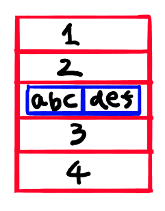

<link rel="stylesheet" href="https://cdnjs.cloudflare.com/ajax/libs/codemirror/5.35.0/codemirror.css" />
<script src="https://cdnjs.cloudflare.com/ajax/libs/codemirror/5.35.0/codemirror.js"></script>
<script src="https://cdnjs.cloudflare.com/ajax/libs/codemirror/5.35.0/mode/javascript/javascript.js"></script>
<style>
    .CodeMirror { height: auto; border: 1px solid #ddd; }
    .console { border: 1px solid #333; color: rgb(48, 68, 216); padding: 0px 5px 0px 5px; }

    .answer {color: red;  }
    .hideanswer { display: none; }
    .result {font-size: large;}
    .wrong {color: red;  }
    .correct {color: rgb(0, 89, 255);  }


    .column{
        padding: 0.5em 1em;
        margin: 2em 0;
        color: #5d627b;
        background: white;
        border-top: solid 5px #5d627b;
        box-shadow: 0 3px 5px rgba(0, 0, 0, 0.22);
    }    
</style>
<link rel="stylesheet" href="https://rawgit.com/karino2/js-introduction/master/scripts/smoke.css" />
<script src="https://rawgit.com/karino2/js-introduction/master/scripts/smoke.min.js"></script>                    
<script src="https://neil.fraser.name/software/JS-Interpreter/acorn_interpreter.js"></script>

<script type="text/javascript" src="https://rawgit.com/karino2/js-introduction/master/scripts/env.js"></script>


<script>
var questions = [];


document.body.onload = function() {
  initInterpreter();


  setupAllREPL2(5);
  setupAllQuestionsWithScnario(questions);
}
</script>


第六回は辞書とjsonです。
辞書はツクールとかだとあまり使う機会が無いと思うのですが、
プラグインが辞書で出来ているので説明しておこうと思います。

面倒な割にはあまり使い道が無い、残念な回です。グレンラガンで言うと温泉回、ビバップで言う所の冷蔵庫回みたいなもんです。

ではいってみましょう。

# 辞書って何よ？

`配列`は、`要素`を数字で取り出す物です。例えば`hairetu[3]`とかやります。  
`辞書`は、`要素`を文字で取り出す物です。例えば`jisyo["hogehoge"]`とかやります。

「あー、そういうことね、完全に理解した」

と思ったらここで終えても良いのですが、もうちょっと細かい話もしていきましょう。

## 何はともあれ実際の使い方

まずは細かい説明の前に、実際の使い方を見て雰囲気をつかみ、その後説明をしていきます。
では行きましょう。

空（カラって読んでね）の`辞書`は、`{}`で作ります。以下のようなコードです。

```
var nakigoe = {};
```

これで中身がからっぽの、何も入ってない辞書が作れます。

### 辞書への要素の追加は`=`

コードネームはセーラーVみたいですね（若い人には通じない）。

からっぽの`辞書`には、`=`で`要素`を追加していく事が出来ます。
例えば以下みたいな感じです。

```
nakigoe["犬"] = "わんわん";
nakigoe["猫"] = "にゃーん";
nakigoe["おっさん"] = "にゃーん";
nakigoe["あじゃ"] = "むえぇ〜〜";
```

JavaScriptでは、変数の場合、`=`は、右の物を左に入れる、という意味でした。
`辞書`の場合も同じ意味で、`=`で要素を追加出来ます。

### 取り出し方は配列と同様`[]`


`要素`を取り出すには、`配列`と同様`[]`を使います。ただし、配列の場合は`hairetu[0]`とか`hairetu[1]`とかの数字でしたが、
`辞書`は文字です。

```
nakigoe["あじゃ"];
```

`要素`を表示するなら、`MessageBox.show`を使えばOK。

```
MessageBox.show(nakigoe["あじゃ"]);
```

取り出した`要素`を変数に入れる場合は、以下のような感じです。


```
var message = nakigoe["あじゃ"];
```

少し実際のコードを動かしてみましょう。


<div id="ex1">
<input type="button" value="実行" />
<textarea>
// カラの辞書を作る
var nakigoe = {};

// 要素を4つ入れる
nakigoe["犬"] = "わんわん";
nakigoe["猫"] = "にゃーん";
nakigoe["おっさん"] = "にゃーん";
nakigoe["あじゃ"] = "むえぇ〜〜";

// 「あじゃ」に入っている物を取り出して表示
MessageBox.show(nakigoe["あじゃ"]);</textarea>
<b>結果:</b> <span class="console"></span><br>
</div>
  
　  
`辞書`とはこんな感じです。
以下、このコードの細かい説明をしていきます。


## ポケモン預かりボックスと辞書

話を総合した結果、`辞書`とはポケモン預かりボックス（以下ボックスと呼ぶ）にかなり似た物だと思う。

ボックスは、たくさんのポケモンを入れる事が出来る。で、取り出す時は`ニックネーム`を指定して取り出す。
言い換えると、ボックスに`ニックネーム`を指定すると、対応した`ポケモン`が「取り出せる」

JavaScriptの`辞書`は、たくさんの文字などを入れる事が出来る。
で、取り出す時には`キー`を指定します。`辞書`に`キー`を指定すると、対応した`要素`が「取り出せる」。

`キー`というのは、要素につけたニックネームのようなもので、JavaScriptの文字です。

並べてみましょう

- 辞書 ー＞ ボックス
- キー ー＞ ニックネーム
- 要素 ー＞ ボックスのポケモン

だいたいこういう関係になっています。

JavaScriptの`辞書`がポケモンのボックスと違うのは、同じポケモンを複数のボックスに入れられます。
また、箱ごとに別のニックネームがつけられます。

言葉にするとややこしいですね。でもまぁだいたい同じ物です。

先程のコードを、ポケモンのボックスと対応づけて見てみましょう。


### ポケモン預かりボックスで考える、`辞書`

まず、カラの辞書を作る、という事をやりました。

```
// カラの辞書を作る
var nakigoe = {};
```

これは、新しいボックスを作る事に相当します。
ボックスが自由に作れる！凄い！

まぁプログラムですから。

で、`{}`とやると、中にまだ誰もいないボックスが作れる訳です。

その後、`要素`を4つ入れていました。

```
// 要素を4つ入れる
nakigoe["犬"] = "わんわん";
nakigoe["猫"] = "にゃーん";
nakigoe["おっさん"] = "にゃーん";
nakigoe["あじゃ"] = "むえぇ〜〜";
```

`=`の右側がポケモンに相当します。左側の`犬、猫、おっさん、あじゃ`はニックネームに相当します。

だから、

```
nakigoe["あじゃ"] = "むえぇ〜〜";
```

というコードは、nakigoeというボックスに、`むえぇ〜〜`という文字を入れる、その時ニックネームとして、`あじゃ`と名付ける、という意味になります。

で、このボックスから取り出すには、`nakigoe["あじゃ"]`と書く訳です。
こうすると、nakigoeというボックスの、`あじゃ`というニックネームのポケモンが取り出せます。


別に入れるポケモンは、文字じゃなくてもなんでもOKです。
たとえば前回やっった`配列`とかでもなんでもOK。

やってみましょう。こんな感じ：

```
nakigoe["モコ"] = [1, 2, 3, 4];
```

こんな風に、配列を入れたりも出来ます。これじゃぁ全然鳴き声じゃないけど。
配列以外でも、後でやる関数とかも入れられたりします。


お、ポケモンのボックス、なんかこれは分かりやすく説明出来た気がする！

## `辞書`という言葉を考える

ついでに`辞書`という言葉の意味からも考えておきましょう。

現実世界には、`辞書`という物がありますよね。
ここでは国語辞典を考えましょう。なお、紙の辞典を思い浮かべてください。
紙の辞典、もう引かなくなりましたねぇ…

ある日突然、みんなが忖度とかいう言葉を使いまくり始めたとします。
「忖度」、知らねーよ、何この単語。こういう難しい言葉流行らせるのやめろよなぁ、めんどくせー。
というかなんて読むの？そんたく？

という事で仕方ないので、`辞書`で`忖度`を`引いて`みます。
まずは「そ、そ、そ…」と「そ」で探して、次に「ん、ん、ん、」と「ん」で探して、その次に「た、た、た…」と「た」で探すと、この辺で、「そんたく」という単語が見つかります。

で、そこには「他人の心をおしはかる事」という`説明`が書いてあります。

辞書というのは、`単語`で意味の説明を`引く`物、と言えます。
プログラムにおける辞書も、これと似た振る舞いをするものです（というか似ているので辞書と呼ぶ事にしました）。

辞書を引く時は、普通「忖度」だとか、「巣窟」だとか、とにかく`単語`ですよね。
この`単語`で調べて、該当箇所を見つけて、そこにある長い説明を得る、
というのが辞書という物と言えます。

なんかもってまわった言い方ですが、こう言うとプログラムの辞書と似た物になります。  
プログラムの辞書も、何かの`単語`でそこに紐付いた何かをとってくるものです。
プログラムの場合はその単語で引けるのが「説明」とは限らないのですが。


### 辞書は`キー`で引く

プログラムにおいては、この`引く`対象の単語を、`キー`と呼びます。
これが噂の乙キーって奴ですね。
違います。

先程の預かりボックスの例の所では、ニックネームに相当する、と言っていた奴です。

国語辞典の例では、`忖度`がキーです。

辞書で忖度を引く事を、プログラムの用語では、

「国語辞典という`辞書`を、忖度を`キーに`して`引く`」

といいます。
先程のプログラムの例だと、`nakigoe["あじゃ"]`というコードがありました。

このコードは、

「nakigoeという`辞書`を"あじゃ"を`キー`にして`引く`」

といいます。

言葉なんてどうでもいいんですが、`辞書`と`キー`に着目すると辞書は分かりやすくなるので、この2つに注意してみてください。

なお、先程のポケモンの言葉に直すと

「nakigoeというボックスから"あじゃ"というニックネームのポケモンを出す」

という感じでしょうか。

説明だけだと良く分からないので、いろいろやってみましょう。という事で次は課題です。


### 課題: toot数を入れた辞書を作れ

辞書の練習として、雲鯖のアカウントとtoot数が入った辞書を作りましょう。

とりあえず4人くらい、今見てみた数字は以下でした。
コロニキ多いね…

- コロニキ: 56125
- あじゃ: 38726
- るーしー: 15014
- ダニエル: 12518

キーは以下の文字にしましょう。

- コロニキ
- あじゃ
- るーしー
- ダニエル

で、上のtoot数を要素に入れた配列を作りましょう。

<script>
var qobj = {
    id: "q1",
    scenarios: []
}
qobj.scenarios.push({
    setup: ()=> {},
    verify: (intp) => {
        var expect = { "コロニキ": 56125, "あじゃ": 38726, "るーしー": 15014,"ダニエル": 12518 };
        return verifyLocalDictVar(intp, "toots", expect);
    }
});
  questions.push(qobj);
 </script>


<div id="q1">
    <input type="button" value="実行" />
    <textarea>
// この行を書き換えて、空の辞書を作る。変数名は変えないでね。
var toots = 0;

// ここで辞書にキーとtoot数をセット


// 結果表示。ここはいじらないでね。
MessageBox.show("ダニキの戦闘力は " + toots["ダニエル"] + " です。");</textarea>
    <b>結果:</b> <span class="console"></span><br>
    <span class="result"></span><br>
    <input type="button" value="答えを見る" />
    <div class="answer hideanswer">
答え:<br>
var toots = {};<br>
toots["コロニキ"] = 56125;<br>
toots["あじゃ"] =  38726;<br>
toots["るーしー"] = 15014;<br>
toots["ダニエル"] = 12518;<br>
    </div>        
</div>
  
　  
こうやって辞書を作ります。次は作った辞書から、要素を取り出す課題をやってみましょう。

### 課題: 犬を鳴かせよう

辞書から「犬」のキーの要素を取り出して、`MessageBox.show`で表示してください。
なお、課題添削が手抜きなので、結果をハードコードしても正解って出ちゃいますが、`nakigoe`使ってね。

<script>
var qobj = {
    id: "q2",
    scenarios: []
}


qobj.scenarios.push({
    setup: ()=> {},
    verify: (intp) => {
        return verifyMessageBoxOne("わんわん");
    }
});
  questions.push(qobj);
 </script>


<div id="q2">
    <input type="button" value="実行" />
    <textarea>
var nakigoe = {};
nakigoe["犬"] = "わんわん";
nakigoe["猫"] = "にゃーん";
nakigoe["おっさん"] = "にゃーん";
nakigoe["あじゃ"] = "むえぇ〜〜";

// 以下を書き換えて犬を鳴かせよう。
MessageBox.show(nakigoe);</textarea>
    <b>結果:</b> <span class="console"></span><br>
    <span class="result"></span><br>
    <input type="button" value="答えを見る" />
    <div class="answer hideanswer">
答え:<br>
MessageBox.show(nakigoe["犬"]);<br>
    </div>        
</div>
  
　  
この辺は考えるよりも、数をこなして慣れていきましょう。

## カラじゃない辞書を作る

最初から中身の入った辞書を作る事も出来ます。

例えば先程の以下のコード

```
// カラの辞書を作る
var nakigoe = {};

// 要素を4つ入れる
nakigoe["犬"] = "わんわん";
nakigoe["猫"] = "にゃーん";
nakigoe["おっさん"] = "にゃーん";
nakigoe["あじゃ"] = "むえぇ〜〜";
```

は、全く同じことを、以下のように書けます。

```
var nakigoe = {"犬": "わんわん", "猫": "にゃーん", "おっさん": "にゃーん", "あじゃ": むえぇ〜〜〜"};
```

`キー`と`要素`を`:`を間に置いて、`,`で区切って並べると、最初からこれらの`キー`とそれに対応した`要素`の入った辞書が作れます。

なお、第4.5回でやった改行の事情は、`配列`と同じような感じです。

```
var nakigoe = {"犬": "わんわん",
 "猫": "にゃーん",
 "おっさん": "にゃーん", "あじゃ": むえぇ〜〜〜"};
```

こんな感じで、`,`の後で改行を入れる事も出来ます。

### `キー`がローマ字の時は、`"`は無しでもOK

キーを変数名っぽい名前にする場合、`"`無しでもOK,というルールがあります。

例えば、先程のコードの`キー`を、「inu, neko, ossan, awa」にしましょう（あじゃはawaらしいんですよね、アカウント名見ると）。

```
var nakigoe = {"inu": "わんわん",
 "neko": "にゃーん",
 "ossan": "にゃーん",
 "awa": むえぇ〜〜〜"};
```

この場合、`キー`の方のダブルクォート、つまり`"`は省略出来ます。
つまり以下のようなコードでも同じ意味になります。

```
var nakigoe = {inu: "わんわん",
 neko: "にゃーん",
 ossan: "にゃーん",
 awa: むえぇ〜〜〜"};
```

なお、要素は文字以外でも数字も入れられる、と言いました。
例えば以下のようになります。


```
var tairyoku = {inu: 1000,
 neko: 100,
 ossan: 1,
 awa: 500};
```

これは、以下のコードと同じ意味になります。

```
var tairyoku = {};

tairyoku["inu"] = 1000;
tairyoku["neko"] = 100;
tairyoku["ossan"] = 1;
tairyoku["awa"] = 500;
```

見た目はずいぶん違いますよね。


### `キー`がローマ時の時は、`.`でも要素が取り出せる

さらに、`キー`がローマ字の時は、`.`でも取り出せる、という良く分からないルールがあります。
だから、

`nakigoe["awa"]`は、`nakigoe.awa`と書いても同じ意味になります。まぢかよ。
こんな言語、JavaScriptだけっすよ、本当…

実際にやってみましょう。

<div id="ex2">
<input type="button" value="実行" />
<textarea>
// 何か適当に辞書を作る。"inu"とかはinuでもいいんだけど、なんとなくダブルクォートつけた。
var nakigoe = {"inu": "わんわん", "neko": "にゃーん",
 "ossan": "にゃーん","awa": "むえぇ〜〜〜"};

// nakigoe["awa"]の代わりに以下でもOK
MessageBox.show(nakigoe.awa);</textarea>
<b>結果:</b> <span class="console"></span><br>
</div>
  
　  
こんな感じです。`nakigoe.awa`と`nakigoe["awa"]`じゃずいぶん印象違いますよね。


### 課題: toot数を作れ改、今度は`"`無しで

アカウント名を使えば、ダブルクォート無しの辞書の作り方が使える気がする。
まずはtoot数を再掲。

- Lord_murmur: 56125
- awa: 38726
- shioneko: 15014
- DanBrikas: 12518

アカウント名だと誰が誰だか全然分からんね…  
まぁいいです。この`辞書`を、キーを`"`無しの記法で指定する方法で作って下さい。

なお、添削はてぬきなので、どの作り方で作ろうと結果の辞書が同じなら正解って出ます。

<script>
var qobj = {
    id: "q3",
    scenarios: []
}
qobj.scenarios.push({
    setup: ()=> {},
    verify: (intp) => {
        var expect = { "Lord_murmur": 56125, "awa": 38726, "shioneko": 15014,"DanBrikas": 12518 };
        return verifyLocalDictVar(intp, "toots", expect);
    }
});
  questions.push(qobj);
 </script>


<div id="q3">
    <input type="button" value="実行" />
    <textarea>
// この行を書き換えて、toot数の入った辞書を作る。変数名は変えないでね。
var toots = {};

// 結果表示。ここはいじらないでね。
MessageBox.show("コロニキの戦闘力は " + toots["Lord_murmur"] + " です。圧倒的…");</textarea>
    <b>結果:</b> <span class="console"></span><br>
    <span class="result"></span><br>
    <input type="button" value="答えを見る" />
    <div class="answer hideanswer">
答え:<br>
var toots = { Lord_murmur: 56125, awa: 38726, shioneko: 15014, DanBrikas: 12518 };<br>
    </div>        
</div>
  
　  
たくさん作ってると、そのうち慣れます。次はダブルクォート無しの取り出し。

### 課題: `るーしー`のtoot数を表示せよ

ローマ字の`キー`の場合は、`toots.awa`のように、`.`を使ってダブルクォート無しでも要素が取り出せる、という話をしました。
それをここでもやってみましょう。るーしーのtoot数を表示してください。なお、アカウント名はshionekoらしいです。誰やねん。


<script>
var qobj = {
    id: "q4",
    scenarios: []
}
qobj.scenarios.push({
    setup: ()=> {},
    verify: (intp) => verifyMessageBoxOne("15014"),
    verifyScript: (scr) => {
        if(scr.indexOf(".shioneko") == -1) {
            return '"."を使ってね！';
        }
        return true;
    }
});
  questions.push(qobj);
 </script>


<div id="q4">
    <input type="button" value="実行" />
    <textarea>
var toots = {};
toots["Lord_murmur"] = 56125;
toots["awa"] = 38726;
toots["shioneko"] = 15014;
toots["DanBrikas"] = 12518;


// 以下を変えてるーしーのtoot数を表示してください。.を使う奴でお願いします。
MessageBox.show(toots);</textarea>
    <b>結果:</b> <span class="console"></span><br>
    <span class="result"></span><br>
    <input type="button" value="答えを見る" />
    <div class="answer hideanswer">
答え:<br>
MessageBox.show(toots.shioneko);<br>
    </div>        
</div>


**`辞書`と`オブジェクト`**  
JavaScriptの`辞書`は、`オブジェクト`とも言います。  
全く同じ物に2つ名前がついていて、意味無いやん！って感じです。
一応、軽くなんでこんな事態になっているのかを説明しておきます    
　  
他のプログラム言語、例えばJavaなんかは、`辞書`と`オブジェクト`は全然別の物なんですよね。
で、JavaScriptはこの`オブジェクト`を`辞書`で代用している結果、JavaScriptの世界ではこの2つは同じ物になってしまいました。  
例えば`nakigoe.awa`みたいな`.`を使って要素を取り出せる、という仕組みは、Javaのオブジェクトと似せる為にあるんだと思います。   
2つの用語は他の言語との類推で使い分けされている気もしますが、同じ物と思っておいてOKです。    
　  
なお、プログラムの世界ではオブジェクト、という用語をいい加減に使うと「オブジェクト警察」が来ていちゃもんをつけてきますが、ほっときましょう。
{: .column}


# json

そしてjsonです。「じぇいそん」って読みます。チェーンソーとか持ってそうですね。

JavaScriptの入門では珍しいですが、このシリーズではjsonの話もしようと思います。
ツクールMVでは、ゲームを作る時にやった操作はだいたいdataフォルダの下に、Items.jsonなどのjsonファイルとして保存される、みたいな事をどっかで見たので(本当かどうかは知りませんが）。

ツクール的にはjsonを知っておくといろいろ便利な事は多そうですし、
jsonはweb開発やそのほかのプログラムでも良く使うので、知っておいて損は無いでしょう。

という事でjsonの話をしますが、jsonは本質的には配列と辞書を入れ子にした物なので、
まずその辺の話をして、最後にjsonの話をします。


## `配列`の中に`辞書`の中に`配列`を入れる

さて、第5回でやった`配列`には、数字や文字が入れられました。
実はこの中には、さらに`配列`とか`辞書`を入れる事が出来ます。

たとえばこんな感じですね。

```
var hairetu = [1, 2, ["abc", "def"], 3, 4];
```

で、さらに`配列`の中に`辞書`を入れたり、`辞書`の中に`配列`を入れたり出来ます。

```
var iroiro = [1, 2, {a: [3, 4], b: "hoge"}, 5, 6];
```

これで全部分かった、となるならそれで終わりなんですが、`辞書`や`配列`に慣れる為の特訓の一貫として、
ちょっとゆっくりやっていきましょう。

### 配列の中に配列を入れる

まずは、配列の中に配列を入れてみます。

```
var hairetu = [1, 2, ["abc", "def"], 3, 4];
```

こうすると、以下の図のような配列となります。



さて、そこで2番目の要素を取り出すとどうなるでしょう？つまり`hairetu[2]`とするとどうなるか。  
2番目には配列が入っているので、配列が取り出せる訳です。

だから、例えば以下のように変数に入れると、

```
var nanika = hairetu[2];
```

`["abc", "def"]`という配列がnanikaに入ります。

だから`nanika[1]`とやると、`def`が取り出せます。
なかなかややこしいですね。

さらに、一旦変数に入れなくても、`hairetu[2][1]`とやると、一気に取り出せます。
並べて書くと、以下みたいな感じ。

```
var nanika = hairetu[2];
nanika[1];
```

```
hairetu[2][1];
```

実際にやってみましょう。


<div id="ex3">
<input type="button" value="実行" />
<textarea>
var hairetu = [1, 2, ["abc", "def"], 3, 4];

hairetu[2][1];</textarea>
<b>結果:</b> <span class="console"></span><br>
</div>  
  
　  
なかなかややこしいですね。
二段階くらいなら、慣れればどうという事は無いですが、どんどん深くなると、誰でも限界は来ます。

どこまで頑張れるかは個人差ありますね。


### 辞書も混ぜる

さらに辞書を入れたり、辞書に入れたりも出来ます。

辞書は、こういう感じで作れるのでした。

```
var jisyo = {awa: 1234, lucy: 4567}
```

ここにさらに、辞書を入れる事も出来ます。

```
var jisyo = {awa: 1234, daniel: ["ダネ", "フシギダネ"], lucy: 4567}
```

danielの所がどうなっているか、理解出来ますか？これはようするに

```
jisyo["daniel"] = ["ダネ", "フシギダネ"];
```

と書いたのと同じ意味になります。つまりdanielを`キー`にして、`["ダネ", "フシギダネ"]`が要素に入る訳です。
取り出し方は`jisyo["daniel"]`か、同じ意味ですが`jisyo.daniel`で取り出せます。

この取り出した結果は`["ダネ", "フシギダネ"]`なので、さらに配列から要素を取り出すべく後ろに`[1]`をつければ、

```
jisyo.daniel[1]
```

で、`フシギダネ`おちう文字が取り出せます。実際にやってみましょう。

<div id="ex4">
<input type="button" value="実行" />
<textarea>
var jisyo = {awa: 1234, daniel: ["ダネ", "フシギダネ"], lucy: 4567};

jisyo.daniel[1];</textarea>
<b>結果:</b> <span class="console"></span><br>
</div>  
  
　  
もう意味が分からないですね。
作ろうと思えばいくらでも複雑な物が作れます。


<div id="ex5">
<input type="button" value="実行" />
<textarea>

// もう最後のカッコとか数あってるか全然分からんね…

var mastodon = {
cloud: [{user: "awa", toots: ["いくよ！いくよ！", "むえぇ〜〜", "ブレ活！"]},
        {user: "lucy", toots: ["こちんこちんに冷えた麦茶", "ぬっくぬくなコーシーをシュルシュルしている"]}],
jp: [{user: "にぎゃーら", toots: ["普段何喋ってるかしらん", "けど良くふぁぼ爆してくる"]}]
};


// さて、何が表示されるでしょう？
MessageBox.show(mastodon.cloud[0].toots[1]);</textarea>
<b>結果:</b> <span class="console"></span><br>
</div>  
  
　  
まぁここまで来ると、パズルみたいな世界です。でもこういうの強いとバカでかいjsonファイルをエディタでえいっと直したりするのには強くなります。そんな事出来なくてもいいんですが。

最後の例は、ほとんどjsonと同じものです。という事で次に、jsonとは何か、という話に入ります。

## json入門

jsonというのは、

1. 辞書
2. 配列
3. 数字
4. 文字
5. true, false ,null (説明していない）

というのを組み合わせた物です。
ようするにJavaScriptなんですが、以下の物はありません

- セミコロン
- 変数
- +とか-とか
- ifとか

JavaScriptのうち、データっぽい物だけを集めた物をjsonといいます。

つまり、これまで見てきた`配列`と`辞書`を組み合わせた物、例えば以下のコードは、

```
var jisyo = {awa: 1234, daniel: ["ダネ", "フシギダネ"], lucy: 4567};
```

変数の所と最後のセミコロンをなくせば、jsonです。こんな感じ。

```
{awa: 1234, daniel: ["ダネ", "フシギダネ"], lucy: 4567}
```

これはjsonです。

という事で、jsonという物は、ここまでやってきた事の一部でしかありません。

ただ、jsonは単純であるおかげで、結構いろんな所で使われています。
ツクールMVのゲームのdataフォルダの下などにはたくさんjsonファイルが入っているそうですね。

他にも、twitterのAPIとかいろんな所でjsonがやりとりされています。

**json警察だ！**  
世の中cw警察が居るように、json警察も居ます。
json警察的には、`キー`はダブルクォートで囲ってないと怒ります。
つまり、`{lucy: 1234}`は厳密にはjsonでは無く、`{"lucy": 1234}`と書け、と怒ります。  
　  
別にそう書いてもいいし、実際そう書くと決まっていて、ツクールMVのjsonもちゃんとダブルクォートつけてますね。  
現実問題としても、なんか動かない時は`キー`にもダブルクォートつけるか、くらいな事はする事あります。  
でも、JavaScriptで扱う分にはだいたいどっちでも構わない。なのでどっちでもいい。  
json警察は怒らせておけばいいんじゃないか。cw警察だってみんな気にしないでしょ？
XX警察ってそういうもんです。
{: .column}


### jsonの例

最後に軽くjsonの例などを眺めて終わりにしたいと思います。
といっても軽く眺めるだけです。

例えば武器とか道具とかの一覧などは、以下のような感じのjsonかもしれません。

```
[
{id:1, itemType: 1, value: 20, description: "これは体力が20回復します。"},
{id:2, itemType: 1, value: 80, description: "これは体力が80回復します。"},
{id:3, itemType: 2, value: 10, description: "これは攻撃力が10の武器です。"},
{id:4, itemType: 2, value: 25, description: "これは攻撃力が25の武器です。"},
{id:5, itemType: 3, value: 10, description: "これは防御力が10の鎧です。"},
{id:6, itemType: 3, value: 25, description: "これは防御力が25の鎧です。"},
]
```

これはどうにかするとたぶん変数に入れる事が出来て(たぶん$dataとかに入るかDataManagerとかを使うんだと思う、良く知りません）、例えば`items`という変数に入れたとすると、

```
items[3].description
```

とやると、`これは攻撃力が25の武器です。`という文字が取れると思います。


# 第六回まとめ

今回は`辞書`をやりました。
まず、`辞書`には預かりボックスのように物を入れておけて、
それを`キー`で取り出したり出来る、という物でした。

`辞書`は、

- 空の辞書は`{}`で作る
- 中身のある辞書は `{"あじゃ":1234, "るーしー": 5678}`とか作る
- 取り出す時は`nakigoe["あじゃ"]`みたいに、後ろに`[]`をつけて、中に`キー`の文字を入れる
- `キー`がローマ字の時は、作るのも取り出すのも別の書き方が使える
   - 辞書を作る時、`{awa: 1234}`などのように、ダブルクォートを省略できる
   - 取り出す時は`.`を使って、`nakigoe.awa`と書ける。

という物でした。
また、`json`もやりました。

- 読み方はじぇいそん
- 配列と辞書と、数字と文字と、その他データっぽい物だけを組み合わせた物

今回は決まりばかりだったので、いまいちぼやっとしてるかもしれませんが、
今後いろいろ使っていくので、だんだんと慣れていくと思います。

良く分からなかったら戻って来るくらいでOKかと。


