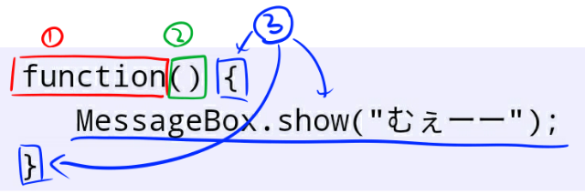

<link rel="stylesheet" href="https://cdnjs.cloudflare.com/ajax/libs/codemirror/5.35.0/codemirror.css" />
<script src="https://cdnjs.cloudflare.com/ajax/libs/codemirror/5.35.0/codemirror.js"></script>
<script src="https://cdnjs.cloudflare.com/ajax/libs/codemirror/5.35.0/mode/javascript/javascript.js"></script>
<style>
    .CodeMirror { height: auto; border: 1px solid #ddd; }
    .console { border: 1px solid #333; color: rgb(48, 68, 216); padding: 0px 5px 0px 5px; }

    .answer {color: red;  }
    .hideanswer { display: none; }
    .result {font-size: large;}
    .wrong {color: red;  }
    .correct {color: rgb(0, 89, 255);  }


    .column{
        padding: 0.5em 1em;
        margin: 2em 0;
        color: #5d627b;
        background: white;
        border-top: solid 5px #5d627b;
        box-shadow: 0 3px 5px rgba(0, 0, 0, 0.22);
    }    
</style>
<link rel="stylesheet" href="https://rawgit.com/karino2/js-introduction/master/scripts/smoke.css" />
<script src="https://rawgit.com/karino2/js-introduction/master/scripts/smoke.min.js"></script>                    
<script src="https://neil.fraser.name/software/JS-Interpreter/acorn_interpreter.js"></script>

<script type="text/javascript" src="https://rawgit.com/karino2/js-introduction/master/scripts/env.js"></script>


<script>
var questions = [];


document.body.onload = function() {
  initInterpreter();


  setupAllREPL2(6);
  setupAllQuestionsWithScnario(questions);
}
</script>

第七回はついに関数です。このシリーズのラスボスですね。  
チェーンソーで切れたり石化くちばしで石に出来たりしたらいいのですが、ラスボスにはバニッシュが効かないのでバニッシュデス出来ないものです。（若い子には通じない）

三回か四回に分けて説明していくつもりです。（五回以上になるかも…）


# 関数の難しさ

とりあえず最初は関数は難しいんだ、というどうでも良い私のポエム的なお話から入ります。これは単なる私の趣味です。

## 言葉が難しい

関数の何が難しいって、まず言葉が難しい。

変数と同様、まず普段使わないですよね、関数。しかもこれ、数学の言葉じゃない？中学生くらいでやる気がする。

数学ってあんた、、、私は算数で挫折したって言ってんだろー！って話になりますが、
数学の関数とプログラムの関数は、似ている所もありますが、結構違います。
なので数学の関数が分からなくても問題無い。

ただ、残念な事に、数学の関数分からなくても問題無いけど、数学の関数より簡単という訳でも無いのです…

## 関数を作る所と使う所

関数の難しさは、二つの見方をする為に、頭を切り替える必要がある所です。
具体的には

- 関数を作る所と使う所

の2つで、頭を切り替える必要があります。
`作る所`と`使う所`の二つがある。  
この、頭を切り替える、というのが、慣れるまでなかなか難しい。

実際の話に入る前に、この難しさについて軽く触れておく事で、
実際に遭遇した時の為の心の準備をしておきたいと思います。

突然水に入るとショック死しちゃうかもしれないので、ちょっとずつ慣らすのです。

### 関数は「作って」次に「使う」

関数は、まず「作って」、その出来た関数を別の所で「使う」、というのが関数の基本となります。
作る場所と使う場所が別だ、という所が、関数が変わっている所。

コードがつらつら書いてある時に「ここは関数を作っている場所だ」と意識して読む必要があります。
これは、関数以外のプログラムが、なんとなく書いてある事を見てるだけで、曖昧でも意味が分かるのとは違って、
関数を理解するには、読む人がちゃんと意識して読まないといけない。これが難しい。

このシリーズの範囲では`使う`所はこれまでと同じ話なので大した事無いんですが、`作る`所はちょっと初めて出てきた見慣れない奴感がある。

とにかく「関数を作る所はそれ以外と違うので注意が必要らしい」と警戒しておいてください。

なお、難しい言葉で言うと関数を作る所を「関数を定義する所」と呼び、
使う所を「関数を実行する所」と呼びます。


### 「考えない」難しさ

関数を`使う`時には、`作る側`を「考えない」という事が必要になります。
この「考えない」というのが難しい。
自分で作った物なのに、まるで知らないフリをする必要があります。

これは例えるなら、鳥でアニメキャラとかのなりきりアカウントをやってる人で、突然プライベートの話も始めるようなのをフォローするのに似ています。
ガチレズ大井botが突然botじゃなくなるみたいなもんですね(それもまた違うか）。

なりきりの部分はそのキャラとして見つつ、
プライベートの話は中の人として見るような、切り替えが必要です。

キャラとしてつぶやいている物は、キャラとしてみてやって、
つぶやいている人の事は考えてはいけません。

どっちも同じ人じゃん、と言ってはいけません。これが難しい。

この「考えない」というのは、かなり頑張らないと難しい事があります。
最近は、のじゃろりおじさんとか、声はおっさんなのにおっさんと思ってはいけない、とか、
なかなか訓練されてないときついですよね。


### 関数は、あなたが作った物をシステムが使う場合がある

関数は作る場所と使う場所が別なので、
たまにあなたが作ったものを、あなたじゃない人が使う事があります。
良くあるのはゲームシステムが使う、とかですね。

プラグインなどは全部これです。プラグインを作る人と使う人は普通違う。
当たり前に聞こえるかもしれないけど、プログラムになるとこれがなかなか難しい。

また、例えばUpdateという関数は、作るのは我々だけど使うのはゲームエンジン、という事があります。
Unityなんかだと毎フレームUpdateという関数が呼ばれます（確かツクールMVも似たようなのあったはず）。

この時、我々は使う側の事は良く知らない場合があります。
ただこの関数が毎回使われる事だけは知っている。

この、使う人の事は知らないけど、使われる側の人として関数を作る、
というのは、「使われる」という「られる」側の立場で考えないといけなくて、
なかなか難しい。


## 特別な変数がある

関数には、`this`とか`arguments`とか、特別な意味を持つ変数があります。また、仮引数とかいうのもあります。
これらが何なのかはおいおい説明していきますが、
なんか3つも知らない事があるのは難しそうな気がしますよね。

## という事で関数は難しい

そうなのです。関数はなかなか手強い奴なのです。そもそもにここまでの説明がなんか難しい気がする。（実際の関数より難しいような？）

でも、難しい難しい言ってても始まらないので、難しいという話はこの位にして、
実際にJavaScriptの関数を見ていきましょう。


# 勇気を出して、はじめての関数

関数とは何か、というのを最初に言葉で説明するのは難しいので、説明の前にまず実例を見ていきます。
実例を見ていきながらその都度説明を足していって、最後に関数とは何か、という説明をしたいと思います。

という事でまず、実際のコードを見てみましょう。
こんな感じです。

<div id="ex1">
<input type="button" value="実行" />
<textarea>

// 関数を作る
var naku = function() {
   MessageBox.show("むぇーー");
};

// 関数を使う
naku();</textarea>
<b>結果:</b> <span class="console"></span><br>
</div>
  
　  
なんかワックスを掛けて、ワックスをふき取る、みたいな感じですね。（ベストキット、若い子は知らないか…）  
実行すると、ただ

```
   MessageBox.show("むぇーー");
```

と書いたのと同じ結果になります。

では以下のコードはどうでしょう？

<div id="ex2">
<input type="button" value="実行" />
<textarea>

// 関数を作る。今度は使うコード無し
var naku = function() {
   MessageBox.show("むぇーー");
};</textarea>
<b>結果:</b> <span class="console"></span><br>
</div>
  
　  
今度は何も起きません。

このコードは、関数を「作る」だけで、作った関数を「使ってない」んですね。

作った関数を使うには、

```
naku();
```

とすれば良い。
これで関数の二大要素、`関数を作る`と`関数を使う`のコードを見た事になります。

「あー、そういう事ね。完璧に理解した。」と思ったなら第七回はこれで終わりです。
が、「分かるかー！」っていうのが普通の反応だと思います。

という事で、次にこれらのコードを細かく解説していきましょう。

## 関数を「作る」

先程のコードで関数を作っていたのは以下の部分になります。

```
var naku = function() {
   MessageBox.show("むぇーー");
};
```

このうち、イコールより右側の部分、つまり以下の部分

```
function() {
   MessageBox.show("むぇーー");
}
```

が、関数を作っている所になります。
これが今回の第七回のメインとなる所です。

このコードはさらに、以下の3つの部分に分けられます。

関数は順番に、

1. `function`というキーワード
2. かっこ、つまり`()`
3. `{`で始まっていろいろ文が続き、`}`で終わるまで

の3つの要素で作る事が出来ます。





1と2はしばらくはそういうもの、と思ってセットで覚えてしまってください。
第八回で`仮引数`、という物をやる時に、2の意味はもうちょっと分かってきますが、
それまでは単なるお約束です。

関数を作るのは`function()`で始める、これがまず最初に覚えるべき事です。

3の`{`と`}`で囲まれている所が`関数の中身`となります。

### `{`と`}`で囲まれた関数の中身

関数は`function ()`で始まり、その後に本体となる「`{`と`}`で囲まれた所」が来ます。

この「囲まれた所」の中には、第六回までやってきたプログラムを全て書く事が出来ます。
`if`でも`MessageBox.yesNo`でも、`Math.randomInt`でも辞書でも配列でも書く事が出来ます。

ただ、この中に書いた事は、関数を`作る時`には実行されません。`使う時`に実行されます。

この「書かれているプログラムが実行されない」というのが、関数の難しさの最も大きな所となります。
大切な事なのでもう一回書きましょう。

```
関数の中身は、作る時には実行されない
```

これが関数の一番の難しさです。

### もうちょっと複雑な関数の中身の例

[第四回](ch4.md)では、yesNoの質問とif文をやりました。

例えば以下みたいなコードがありました。

<div id="ex3">
<input type="button" value="実行" />
<textarea>
var tumetai = MessageBox.yesNo("こちんこちん？", "はい", "いいえ");

if(tumetai == 1) {
   MessageBox.show("麦茶！");
} else {
   MessageBox.show("こーしー");
}</textarea>
<b>結果:</b> <span class="console"></span><br>
</div>
  
　  
100本ノックより前なので、結構昔な気がしますね。覚えてるでしょうか？私は忘れてたので第四回をちょっと読み直しました…

`MessageBox.yesNo`は、「はい」が選ばれたら`1`を、「いいえ」が選ばれたら`0`を返すのでした。
で、上のコードで、`こちんこちん`だったら`麦茶！`が、そうでなければ`こーしー`が表示されます。
るーしーも納得。

このコードを、`関数の中身`に入れてみましょう。

<div id="ex4">
<input type="button" value="実行" />
<textarea>

var lucy = function() {
    var tumetai = MessageBox.yesNo("こちんこちん？", "はい", "いいえ");

    if(tumetai == 1) {
        MessageBox.show("麦茶！");
    } else {
        MessageBox.show("こーしー");
    }
};</textarea>
<b>結果:</b> <span class="console"></span><br>
</div>
  
　  
やはり今回も、実行しても一見何も起きません。
ですが、このコードで`lucy`という変数に作った関数が入る事になります。

とりあえずここまでの話をまとめておきましょう。

### 関数の作り方まとめ

1. `function()`で始める
2. その次に`{`から`}`までが`関数の中身`となる
3. 関数は、`作る`時には、`関数の中身`は実行されない

おまけになりますが、変数に入れる所も軽く説明しておきましょう。


### 作った関数を変数に入れる

先程のコードを見直すと、以下のようになっていました。

```
var naku = function() {
   MessageBox.show("むぇーー");
};
```

ここで、`var naku = `は通常の変数と同じです。

例えば、これまで以下のようなコードで、`にゃーん`という文字を変数に入れていました。

```
var naku = "にゃーん";
```

この`"にゃーん"`の部分を`関数を作る`というコードに置き換えると、上のプログラムになります。

`関数を作る`というのは以下のコードでした。

```
function() {
   MessageBox.show("むぇーー");
}
```

これを先程の`"にゃーん"`に置き換えたものです。

理屈はあまり気にしないでそういう物だ、と覚えてしまってもOKですが、気になる人も居るかもしれないので一応解説しておきました。


### 課題、関数の中身にせよ

関数を作る練習として、まずは関数の外にある`MessageBox.show`を関数の中に移動してください。
関数のなかみは、関数を作る時には実行されないので、正解すると何も表示されなくなるはずです。

<script>
var qobj = {
    id: "q1",
    scenarios: []
}


qobj.scenarios.push({
    setup: ()=> {},
    verify: (intp) => {
        if(scenarioLogs.length != 0) {
          return "MessageBox.showが関数以外で呼ばれてしまっています。";
        }

        var func = intp.pseudoToNative(intp.getProperty(intp.global, "naku"));
        if(func == undefined) {
            return "変数、nakuが無くなってる…";
        }

        intp.appendCode("naku();");
        intp.run();


        if(scenarioLogs.length == 0 || scenarioLogs[0].name != 'alert') {
          return "nakuの中身でMessageBox.showが実行されません。";
        }

        var actual = scenarioLogs[0].val;
        if(actual != "むぇーー") {
          return "表示されたメッセージが違います。";
        }
        return true;
    }
});
  questions.push(qobj);
 </script>


<div id="q1">
    <input type="button" value="実行" />
    <textarea>

// この行を、以下の関数の中身へ移動せよ
MessageBox.show("むぇーー");

var naku = function () {};</textarea>
    <b>結果:</b> <span class="console"></span><br>
    <span class="result"></span><br>
    <input type="button" value="答えを見る" />
    <div class="answer hideanswer">
答え:<br>
var naku = function() {<br>
&nbsp;&nbsp;&nbsp;&nbsp;MessageBox.show("むぇーー");<br>
};
    </div>        
</div>
  
　  
このように、関数の中に移すと実行されなくなります。

もう一つ行ってみましょう。今度は二行です。


<script>
var qobj = {
    id: "q2",
    scenarios: []
}


qobj.scenarios.push({
    setup: ()=> {},
    verify: (intp) => {
        if(scenarioLogs.length != 0) {
          return "MessageBox.showが関数以外で呼ばれてしまっています。";
        }

        var func = intp.pseudoToNative(intp.getProperty(intp.global, "lucy"));
        if(func == undefined) {
            return "変数、lucyが無くなってる…";
        }

        intp.appendCode("lucy();");
        intp.run();
        if(scenarioLogs.length != 2 || scenarioLogs[0].name != 'alert') {
          return "lucyの中身でMessageBox.showが二回は実行されません。";
        }

        if(scenarioLogs[0].val != "こーしーを") {
          return "表示されたメッセージが違います。";
        }
        if(scenarioLogs[1].val != "しゅるしゅるする") {
          return "表示されたメッセージが違います。";
        }
        return true;
    }
});
  questions.push(qobj);
 </script>


<div id="q2">
    <input type="button" value="実行" />
    <textarea>

// 以下の二行を、下の関数の中身へ移動せよ
MessageBox.show("こーしーを");
MessageBox.show("しゅるしゅるする");

var lucy = function () {};</textarea>
    <b>結果:</b> <span class="console"></span><br>
    <span class="result"></span><br>
    <input type="button" value="答えを見る" />
    <div class="answer hideanswer">
答え:<br>
var lucy = function() {<br>
&nbsp;&nbsp;&nbsp;&nbsp;MessageBox.show("こーしーを");<br>
&nbsp;&nbsp;&nbsp;&nbsp;MessageBox.show("しゅるしゅるする");<br>
};
    </div>        
</div>
  
　  
この時点だと何も実行されないのでありがたみが無いですね。
そこはこの後に出てくるので、現時点では練習と割り切ってやっていきましょう。

### 課題、関数を作れ

では今度は自分で`function()`なども書く事をやってみましょう。

<script>
var qobj = {
    id: "q3",
    scenarios: []
}


qobj.scenarios.push({
    setup: ()=> {},
    verify: (intp) => {
        if(scenarioLogs.length != 0) {
          return "MessageBox.showが関数以外で呼ばれてしまっています。";
        }

        var func = intp.pseudoToNative(intp.getProperty(intp.global, "naku"));
        if(func == undefined) {
            return "変数、nakuが無くなってる…";
        }

        intp.appendCode("naku();");
        intp.run();


        if(scenarioLogs.length == 0 || scenarioLogs[0].name != 'alert') {
          return "nakuの中身でMessageBox.showが実行されません。";
        }

        var actual = scenarioLogs[0].val;
        if(actual != "コケーー") {
          return "表示されたメッセージが違います。";
        }
        return true;
    }
});
  questions.push(qobj);
 </script>


<div id="q3">
    <input type="button" value="実行" />
    <textarea>

// この行を、関数の中身へ移動せよ
MessageBox.show("コケーー");

// 今度はfunctionとかも自分で書く。以下の変数に作った関数を入れる。
var naku = 0;</textarea>
    <b>結果:</b> <span class="console"></span><br>
    <span class="result"></span><br>
    <input type="button" value="答えを見る" />
    <div class="answer hideanswer">
答え:<br>
var naku = function() {<br>
&nbsp;&nbsp;&nbsp;&nbsp;MessageBox.show("コケーー");<br>
};
    </div>        
</div>
  
　  
もう一つ行ってみますか。
今度はif文も入れます。

<script>
var qobj = {
    id: "q4",
    scenarios: []
}


qobj.scenarios.push({
    setup: ()=> returnValues.push(1),
    verify: (intp) => {
        if(scenarioLogs.length != 0) {
          return "関数の外でMessageBox.showかMessageBox.yesNoが呼ばれてしまっています。";
        }


        var func = intp.pseudoToNative(intp.getProperty(intp.global, "lucy"));
        if(func == undefined) {
            return "変数、lucyが無くなってる…";
        }

        intp.appendCode("lucy();");
        intp.run();

        if(scenarioLogs.length < 1 || scenarioLogs[0].name != 'yesNo') {
          return "こちんこちん？って関数の中で質問されない…";
        }

        if(scenarioLogs.length < 2 || scenarioLogs[1].name != 'alert') {
          return "こちんこちんなのに麦茶って表示されない";
        }

        var actual = scenarioLogs[1].val;
        if(actual != "麦茶！") {
          return "こちんこちんなのに麦茶って表示されない";
        }
        return true;
    }
});
qobj.scenarios.push({
    setup: ()=> returnValues.push(0),
    verify: (intp) => {
        intp.appendCode("lucy();");
        intp.run();

        if(scenarioLogs.length < 2 || scenarioLogs[1].val != "こーしー") {
          return "ぬっくぬくなのにこーしーって表示されない";
        }
        return true;
    }
});
  questions.push(qobj);
 </script>


<div id="q4">
    <input type="button" value="実行" />
    <textarea>

// 以下のコードを、関数の中身へ移動せよ
var sentaku = MessageBox.yesNo("こちんこちん？", "はい", "いいえ");
if(sentaku == 1) {
    MessageBox.show("麦茶！");
} else {
    MessageBox.show("こーしー");
}

// 今度もfunctionとかは自分で書く。以下の変数に作った関数を入れる。
var lucy = 0;</textarea>
    <b>結果:</b> <span class="console"></span><br>
    <span class="result"></span><br>
    <input type="button" value="答えを見る" />
    <div class="answer hideanswer">
答え:<br>
var lucy = function() {<br>
&nbsp;&nbsp;&nbsp;&nbsp;var sentaku = MessageBox.yesNo("こちんこちん？", "はい", "いいえ");<br>
&nbsp;&nbsp;&nbsp;&nbsp;if(sentaku == 1) {<br>
&nbsp;&nbsp;&nbsp;&nbsp;&nbsp;&nbsp;&nbsp;&nbsp;MessageBox.show("麦茶！");<br>
&nbsp;&nbsp;&nbsp;&nbsp;} else {<br>
&nbsp;&nbsp;&nbsp;&nbsp;&nbsp;&nbsp;&nbsp;&nbsp;MessageBox.show("こーしー");<br>
&nbsp;&nbsp;&nbsp;&nbsp;}<br>
};
    </div>        
</div>
  
　  
こんな風に、`function()`で始めて、`{`と`}`の間に中身を入れます。

**関数の中身の、行のはじめの空欄**  
[第4.5回](ch4_5.md)でやった、「行のはじめの所に空欄入れるのなんなの？」という話がありました。
その「行のはじめの空欄」（普通プログラムでは空白と言いますが）の、関数についてその辺どうするか？を、ここで軽く触れておきます。  
関数の中身は、普通行の先頭にスペースを4つ入れます。ifの中と同じ感じです。その中にさらにifがあると、ifの中はさらに4つ空欄つけるので、8つスペースが入ります。  
　  
言葉で説明するとなんだかややこしいですが、今回のコードを見ていけばなんとなく分かると思います。
この手のは、説明をさらっと眺めた後は実際を見る、という感じで、実例から理解するのがオススメです。
所詮見た目がいい感じになるかどうか、という問題なので、見た感じで判断する方が良い。  
　  
なお、課題に答える時にいちいちスペース入れるのはかったるいので、入れなくてもいいです。  
ただ、このシリーズで使ってるテキストエリアは、関数の中をマウスでびーっと選択して、タブを押すと一気に全部空欄を4つ入れられます。
これを使うとそんな大変でも無い。  
何を言っているか分からん、とか、私はスマホでやってる、とかいう人は気にしないでください。
そもそも空欄とかは読みやすい為に入れるんであって、どうでもいいものです。
{: .column}


## 関数を「使う」

関数は、`作る`だけでは何も起こりません。
作った関数を`使う`事で、初めて`関数の中身`が実行されます。

ここでは関数の`使い方`を見ていきましょう。


### 最初のコードに見る、関数の使い方

先程のコードをもう一度見てみましょう。
以下のようになっていました。


```
// 関数を作る
var naku = function() {
   MessageBox.show("むぇーー");
};

// 関数を使う
naku();
```

このうち、以下の部分が`関数を使う`所です。

```
// 関数を使う
naku();
```

使い方は、関数の入った変数に対し、変数名に`()`をつけると使えます。
この場合は変数名は`naku`なので、これに`()`をつけて、`naku()`とすれば良い、という訳です。
そして行の最後にはセミコロン、つまり`;`を置く。  
全部合わせると`naku();`となります。

一度作った関数は、何度も使う事も出来ます。やってみましょう。


<div id="ex5">
<input type="button" value="実行" />
<textarea>
// 関数を作る
var naku = function() {
   MessageBox.show("むぇーー");
};


// 関数を3回使う
naku();
naku();
naku();</textarea>
<b>結果:</b> <span class="console"></span><br>
</div>
  
　  
関数の`中身`が三回実行されます。

先程のlucyの例もやってみましょう。

<div id="ex6">
<input type="button" value="実行" />
<textarea>

var lucy = function() {
    var tumetai = MessageBox.yesNo("こちんこちん？", "はい", "いいえ");

    if(tumetai == 1) {
        MessageBox.show("麦茶！");
    } else {
        MessageBox.show("こーしー");
    }
};

// この行を新しく追加
lucy();</textarea>
<b>結果:</b> <span class="console"></span><br>
</div>
  
　  
このように、`naku()`とか`lucy()`などのように、`変数名`+`()`で関数を使う事が出来ます。


### 課題： 関数を使おう

まずはnakuという変数に関数を入れておくので、この関数を二回`使い`ましょう。関数を使うのは、`変数名`に`()`をつけるのでした。
最後のセミコロンも忘れずに。


<script>
var qobj = {
    id: "q5",
    scenarios: []
}


qobj.scenarios.push({
    setup: ()=> {},
    verify: (intp) => {
        if(scenarioLogs.length < 2) {
          return "二回呼ばれて無さそうです。";
        }

        for(var i = 0;i < 2; i++) {
            if(scenarioLogs[i].val != "むぇーー") {
                return i + "回目に表示されたメッセージが違います";
            }

        }
        return true;
    }
});
  questions.push(qobj);
 </script>


<div id="q5">
    <input type="button" value="実行" />
    <textarea>

var naku = function() {
    MessageBox.show("むぇーー");
};

// TODO: ここでnakuを二回呼ぶ
</textarea>
    <b>結果:</b> <span class="console"></span><br>
    <span class="result"></span><br>
    <input type="button" value="答えを見る" />
    <div class="answer hideanswer">
答え:<br>
naku();<br>
naku();
    </div>        
</div>
  
　  
もう一つ行ってみますか。

次はlucyという変数に関数を入れておくので、この関数を`使って`下さい。
なお、関数を使う事を`呼び出す`とも言います。


<script>
var qobj = {
    id: "q6",
    scenarios: []
}


qobj.scenarios.push({
    setup: ()=> {},
    verify: (intp) => {
        if(scenarioLogs.length < 3) {
          return "lucyが呼ばれて無さそうです。";
        }
        if(scenarioLogs.length >= 6) {
          return "二回以上呼ばれてそうです。一回でお願いします。";
        }

        var expects  = ["ぬっくぬくな", "こーしーを", "しゅるしゅるする"];

        for(var i = 0;i < expects.length; i++) {
            if(scenarioLogs[i].val != expects[i]) {
                return i + "回目に表示されたメッセージが違います。関数の中いじらないで！";
            }
        }
        return true;
    }
});
  questions.push(qobj);
 </script>


<div id="q6">
    <input type="button" value="実行" />
    <textarea>

var lucy = function() {
    MessageBox.show("ぬっくぬくな");
    MessageBox.show("こーしーを");
    MessageBox.show("しゅるしゅるする");
};

// TODO: ここでlucyを呼ぶ。今度は一回でいいです。
</textarea>
    <b>結果:</b> <span class="console"></span><br>
    <span class="result"></span><br>
    <input type="button" value="答えを見る" />
    <div class="answer hideanswer">
答え:<br>
lucy();<br>
    </div>        
</div>
  
　  
呼び出す方は結局同じ感じなので、問題を作るのが難しいですね。
少し課題の数が足りない気もしますが、今回はこの位にしておきますか。

# 第七回まとめ

今回は、関数の`作り方`と`使い方`をやりました。

1. 関数を作る時は、`function()`で始め、その後ろに`{`と`}`で囲んで`関数の中身`を置く
2. `関数の中身`は、作る時には実行されない。関数を`使う`と実行される
3. `関数の使い方`は、関数の入った`変数名`に`()`をつける。例えば`lucy();`とか`naku();`とか
4. 一度作った関数は何度も使える

第七回ではこの位を分かっていてもらえれば十分かな、と思います。

今回やった事は以後の関数の回では全て使い続けるので、最初良く分からなくてもすぐに慣れると思います。


**JavaScriptの関数は特別難しい**  
もともと関数という物自体どのプログラミング言語だろうと難しいものですが、
JavaScriptというプログラミング言語は、
その数あるプログラミング言語の中でもトップクラスに関数が難しいプログラミング言語だと思います。  
ただでさえ関数は難しいのに、JavaScriptはその中でも特に関数が難しいプログラミング言語だったのです。なんてこった！    
　  
無名関数も作れて、ネストした関数も作れて、フリー変数も捕捉されるレキシカルスコープなクロージャでargumentsのような特殊な変数がありながら仮引数も使え、
高階関数もいくらでも定義出来、
関数自身がオブジェクトであり特殊なメンバも持っていて、さらに自動的にコンストラクタとしても使え、
prototypeチェーンのような細工も出来て、
呼ばれる時のレシーバをいろいろ細工するようなcallやapplyのような物まである。  
　  
そもそもに型無しラムダ計算を人類が理解出来ているかは意味論の進展を見てもかなり怪しい所なので、そもそも人類は理解出来ていない可能性すらある。  
　  
さすがにこの書き方は事実ではあっても大げさとは思いますが、JavaScriptは実際、関数がいろんな使い方が出来る言語の一つです。
もともとJavaScriptは簡易的な、ちょっとした事に使うおもちゃ言語で、あまり本格的に使おうという言語ではありませんでした。  
ですが、関数だけは作った人の趣味で非常に強力で本格的だったおかげで、Chromeが出た頃からかなり本格的な用途に使おう、という人が増えてきて現在の地位につけました。  
　  
これは偶然では無く、もともとJavaScriptは、Schemeという言語をかなりの程度真似て作られています。SchemeをJavaっぽい見た目で実装したのがJavaScriptだ、という噂もあるほどです。  
このSchemeというのは、関数だけの言語といっても良いくらい関数以外の要素が無い言語で、その代わり関数だけが凄く強力、という物でした。
そのSchemeを真似したJavaScriptも関数が凄く強力、というのは、狙ってやった事でしょう。  
　  
現在ではJavaScriptの関数のようなレキシカルなスコープを持つクロージャも珍しくはありませんが、結構最近までは、主流の言語には珍しい機能でした。  
例えばC言語などには無い機能ですし、似たような機能がC++にも入ったのは2011年の事です。  
実はJavaScriptと言えば関数、と言っても良いくらい、JavaScriptの関数は強力で、かつ先進的でした。
{: .column}
